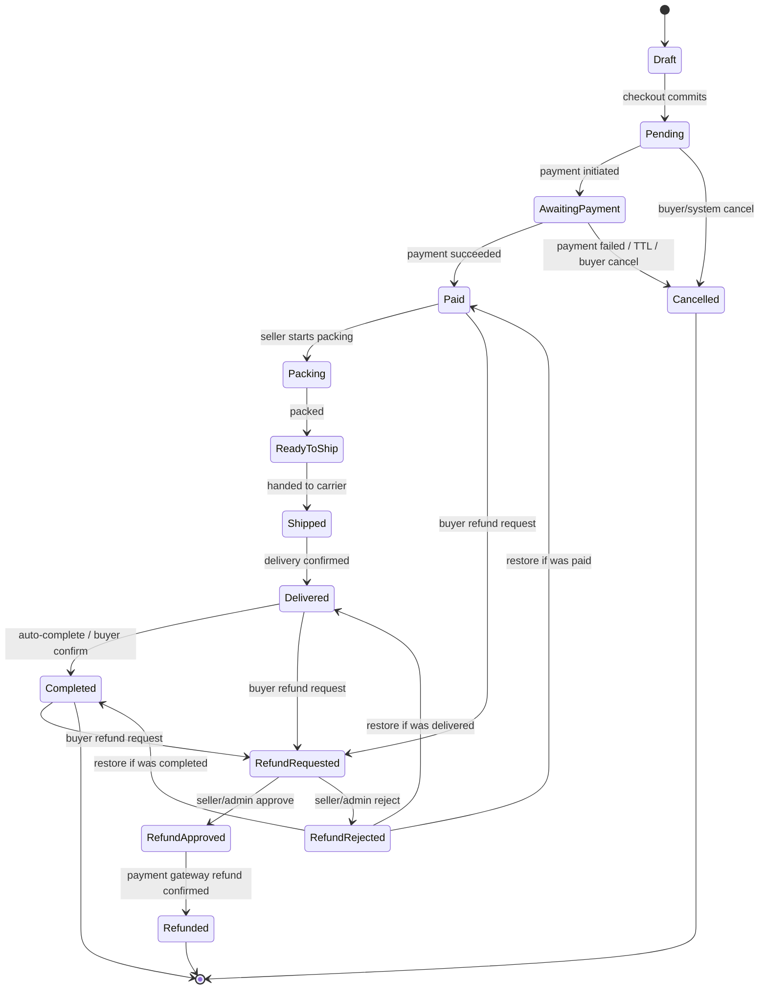

# Architecture Decision Records (ADR)

Version: 1.0  
Project: LiveCommerce Platform  
Status: Architecture Phase  
Document Owner: Founder & CTO  
Last Updated: 2026-06-28

---

## Purpose

This document records every important architectural decision made during the LiveCommerce platform project. It preserves the reasoning behind technology choices, patterns, and approaches.

Every major technical decision must be documented here **before implementation**.

---

## ADR Index

| ADR | Title | Status | Date |
|-----|-------|--------|------|
| [ADR-001](#adr-001-flutter-for-mobile) | Flutter for Mobile | Accepted | 2026-06-27 |
| [ADR-002](#adr-002-laravel-modular-monolith) | Laravel Modular Monolith | Accepted | 2026-06-27 |
| [ADR-003](#adr-003-postgresql-as-primary-database) | PostgreSQL as Primary Database | Accepted | 2026-06-27 |
| [ADR-004](#adr-004-redis-for-cache-and-queues) | Redis for Cache and Queues | Accepted | 2026-06-27 |
| [ADR-005](#adr-005-jwt-authentication) | JWT Authentication | Accepted | 2026-06-27 |
| [ADR-006](#adr-006-repository-pattern) | Repository Pattern | Accepted | 2026-06-27 |
| [ADR-007](#adr-007-service-layer) | Service Layer | Accepted | 2026-06-27 |
| [ADR-008](#adr-008-docker-for-local-development) | Docker for Local Development | Superseded → ADR-018 | 2026-06-27 |
| [ADR-009](#adr-009-riverpod-for-state-management) | Riverpod for State Management | Accepted | 2026-06-27 |
| [ADR-010](#adr-010-s3-compatible-object-storage) | S3-Compatible Object Storage | Accepted | 2026-06-27 |
| [ADR-011](#adr-011-agora-as-default-streaming-provider) | Agora as Default Streaming Provider | Accepted | 2026-06-27 |
| [ADR-012](#adr-012-ai-adapter-integration-strategy) | AI Adapter Integration Strategy | Accepted | 2026-06-27 |
| [ADR-013](#adr-013-pest-testing-framework) | Pest Testing Framework | Accepted | 2026-06-27 |
| [ADR-014](#adr-014-openapi-scramble-documentation) | OpenAPI / Scramble Documentation | Accepted | 2026-06-27 |
| [ADR-015](#adr-015-mailpit-for-local-email-testing) | Mailpit for Local Email Testing | Accepted | 2026-06-27 |
| [ADR-016](#adr-016-commerce-core-cart-orders-inventory-payment) | Commerce Core: Cart, Orders, Inventory, Payment | **Accepted** | 2026-06-28 |
| [ADR-017](#adr-017-order-state-machine-and-order-aggregate) | Order State Machine & Order Aggregate | **Accepted** | 2026-06-28 |
| [ADR-018](#adr-018-supabase--railway-cloud-runtime) | Supabase + Railway Cloud Runtime | **Accepted** | 2026-07-12 |

---

## ADR Template

```
ADR-NNN: Title
Status: Proposed | Accepted | Deprecated | Superseded
Date: YYYY-MM-DD
Context: ...
Problem: ...
Considered Alternatives: ...
Decision: ...
Consequences: ...
Future Review: ...
```

---

## ADR-001: Flutter for Mobile

**Status:** Accepted  
**Date:** 2026-06-27

### Context

The platform is mobile-first. Users consume short-form video, live streams, and shop primarily on smartphones (Android and iOS). A single codebase for both platforms reduces development cost and ensures UI consistency.

### Problem

Choose a mobile framework that supports high-performance video playback, smooth 60 FPS scrolling, live streaming SDK integration, and rapid UI development for a TikTok-style experience.

### Considered Alternatives

| Option | Pros | Cons |
|--------|------|------|
| **Flutter** | Single codebase, 60 FPS rendering, strong video packages, growing ecosystem | Smaller talent pool in Central Asia vs React Native |
| **React Native** | Large ecosystem, Expo tooling | Performance concerns for video-heavy feeds, bridge overhead |
| **Native (Swift + Kotlin)** | Best performance | Two codebases, 2× development cost, slower iteration |

### Decision

Use **Flutter 3.x** with Clean Architecture and Riverpod.

### Consequences

- Positive: Consistent UI across Android/iOS, excellent scroll performance, hot reload speeds development.
- Negative: Team must learn Dart/Flutter; some native SDK integrations require platform channels.
- Neutral: App size slightly larger than native (~15–20 MB overhead).

### Future Review

Revisit if Flutter video performance becomes a bottleneck at scale, or if a third platform (web desktop) is required.

---

## ADR-002: Laravel Modular Monolith

**Status:** Accepted  
**Date:** 2026-06-27

### Context

The backend must serve a REST API for mobile clients, handle async jobs (video processing, notifications), and support eventual scale to millions of users.

### Problem

Choose backend architecture: monolith vs microservices vs modular monolith.

### Considered Alternatives

| Option | Pros | Cons |
|--------|------|------|
| **Laravel Monolith** | Fast development, mature ecosystem, built-in queues/events | Can become tangled without discipline |
| **Microservices** | Independent scaling | Premature complexity for MVP, operational overhead |
| **Node.js (NestJS)** | JS ecosystem | Less mature for heavy queue/worker workloads in our context |
| **Go microservices** | Performance | Higher development cost, no team expertise |

### Decision

Use **Laravel 12 modular monolith** with Service Layer, Repository Pattern, Events, and Queues. Extract to microservices only when a specific module proves to be a bottleneck.

### Consequences

- Positive: Rapid MVP delivery, Laravel Horizon for queues, excellent PostgreSQL support, large package ecosystem.
- Negative: Must enforce module boundaries via code review and architecture rules.
- Neutral: Migration path to microservices exists via event-driven boundaries.

### Future Review

When DAU exceeds 500K, evaluate extracting video processing and recommendation into separate services.

---

## ADR-003: PostgreSQL as Primary Database

**Status:** Accepted  
**Date:** 2026-06-27

### Context

The platform needs a relational database for users, products, orders, social graph, and audit logs with ACID guarantees for financial transactions.

### Problem

Select primary database that supports complex queries, JSONB for flexible fields, full-text search, and future sharding.

### Considered Alternatives

| Option | Pros | Cons |
|--------|------|------|
| **PostgreSQL** | ACID, JSONB, full-text search, mature, read replicas | Vertical scaling limits (mitigated by sharding later) |
| **MySQL** | Wide adoption | Weaker JSON support, less advanced indexing |
| **MongoDB** | Flexible schema | Poor fit for orders/payments relational data |
| **CockroachDB** | Distributed | Overkill for MVP, higher cost |

### Decision

Use **PostgreSQL 16+** as the sole primary relational database.

### Consequences

- Positive: Strong consistency for orders, excellent JSONB for addresses/settings, `gen_random_uuid()` for UUID PKs, full-text search for MVP.
- Negative: Full-text search may need Elasticsearch at scale (Phase 2).
- Neutral: Read replicas added when read load increases.

### Future Review

At 500K+ DAU, evaluate Elasticsearch for search and consider Citus/sharding for user-scoped tables.

---

## ADR-004: Redis for Cache and Queues

**Status:** Accepted  
**Date:** 2026-06-27

### Context

The platform needs in-memory caching for feeds, rate limiting, session tokens, debounced counters (views/likes), and a job queue backend.

### Problem

Choose caching and queue infrastructure.

### Considered Alternatives

| Option | Pros | Cons |
|--------|------|------|
| **Redis** | Cache + queues + pub/sub in one, Laravel native support | Single point of failure without cluster |
| **Memcached** | Simple caching | No queue support |
| **RabbitMQ** | Advanced queuing | Separate system for cache, more ops overhead |
| **Database queues** | No extra infra | Too slow for video processing workloads |

### Decision

Use **Redis 7+** for cache, rate limiting, debounced counters, and Laravel queue backend. Laravel Horizon for queue monitoring.

### Consequences

- Positive: Single system for cache + queues, sub-millisecond reads, Laravel first-class support.
- Negative: Must monitor memory usage; cluster needed at scale.
- Neutral: Redis Cluster planned for Phase 2 (500K+ DAU).

### Future Review

When queue depth consistently exceeds 10K, add dedicated worker pools per queue type.

---

## ADR-005: JWT Authentication

**Status:** Accepted  
**Date:** 2026-06-27

### Context

Mobile app communicates with stateless REST API. Multiple API servers behind load balancer. No server-side sessions.

### Problem

Choose authentication mechanism for mobile ↔ API communication.

### Considered Alternatives

| Option | Pros | Cons |
|--------|------|------|
| **JWT (access + refresh)** | Stateless, scalable, mobile-friendly | Token revocation requires extra infrastructure |
| **Session cookies** | Easy revocation | Poor fit for mobile native apps |
| **OAuth2 only** | Standard | Overkill for first-party mobile app |
| **Sanctum tokens** | Laravel native | Less standard for mobile than JWT |

### Decision

Use **JWT with short-lived access tokens (15 min) and refresh tokens (30 days) with rotation**. Refresh tokens stored hashed in PostgreSQL for revocation.

### Consequences

- Positive: Stateless API scaling, standard mobile pattern, refresh rotation limits exposure.
- Negative: Refresh token table needed for revocation; logout requires DB write.
- Neutral: Social login (Google/Apple) added in v1.1 as additional auth method.

### Future Review

If token theft becomes a concern, add device binding and fingerprint validation.

---

## ADR-006: Repository Pattern

**Status:** Accepted  
**Date:** 2026-06-27

### Context

Business logic must be decoupled from Eloquent ORM to enable testing, future database changes, and clean architecture.

### Problem

Where should database queries live?

### Considered Alternatives

| Option | Pros | Cons |
|--------|------|------|
| **Repository Pattern** | Testable, swappable, clean boundaries | Extra abstraction layer |
| **Eloquent directly in services** | Less code | Harder to test, ORM leaks into business logic |
| **Query Objects** | Good for complex reads | Doesn't cover writes well |

### Decision

Use **Repository Pattern** with interfaces in `app/Contracts/Repositories/` and Eloquent implementations in `app/Repositories/Eloquent/`. Bound via Service Provider.

### Consequences

- Positive: Services testable with mock repositories, consistent query location, future read-replica routing possible.
- Negative: More files per module (~2 extra per entity).
- Neutral: Repositories return Models/Collections, not arrays.

### Future Review

None unless moving to CQRS pattern at scale.

---

## ADR-007: Service Layer

**Status:** Accepted  
**Date:** 2026-06-27

### Context

Controllers must remain thin. Business logic must be reusable across controllers, jobs, and event listeners.

### Problem

Where does business logic live?

### Decision

All business logic in **Service classes** (`app/Services/{Module}/`). Controllers delegate to services. Jobs and listeners call services. Services dispatch events for side effects.

### Consequences

- Positive: Single location for business rules, testable, reusable across entry points.
- Negative: Discipline required to prevent logic leaking into controllers or repositories.
- Neutral: One service per domain module.

### Future Review

None.

---

## ADR-008: Docker for Local Development

**Status:** Superseded by [ADR-018](#adr-018-supabase--railway-cloud-runtime)  
**Date:** 2026-06-27

### Context

Team needs consistent local development environment across Windows, macOS, and Linux.

### Problem

How to standardize local dev setup for PHP, PostgreSQL, Redis, and MinIO?

### Decision

Use **Docker Compose** for local development. Production uses managed services / container orchestration separately.

### Consequences

- Positive: Identical environment for all developers, easy onboarding, includes MinIO for S3 testing.
- Negative: Docker resource usage on developer machines, Windows Docker Desktop quirks.
- Neutral: Production deployment not tied to Docker Compose.

### Future Review

Evaluate dev containers or Laravel Sail if team grows.

---

## ADR-009: Riverpod for State Management

**Status:** Accepted  
**Date:** 2026-06-27

### Context

Flutter app uses Clean Architecture. State management must support dependency injection, testability, and granular rebuilds for performance.

### Problem

Choose Flutter state management solution.

### Considered Alternatives

| Option | Pros | Cons |
|--------|------|------|
| **Riverpod** | Compile-safe, testable, no BuildContext needed, granular rebuilds | Learning curve |
| **Bloc** | Well-documented, event-driven | More boilerplate |
| **Provider** | Simple | Less powerful, superseded by Riverpod |
| **GetX** | Fast to prototype | Tight coupling, discouraged for large apps |

### Decision

Use **Riverpod** with Notifier pattern for feature state.

### Consequences

- Positive: Excellent testability, compile-time safety, works well with Clean Architecture.
- Negative: Team must learn Riverpod patterns.
- Neutral: Code generation optional (riverpod_generator) for larger providers.

### Future Review

None.

---

## ADR-010: S3-Compatible Object Storage

**Status:** Accepted  
**Date:** 2026-06-27

### Context

Platform stores videos, product images, avatars, and store logos. Files range from 50 KB (avatars) to 500 MB (videos). CDN required for delivery.

### Problem

Choose object storage provider.

### Considered Alternatives

| Option | Pros | Cons |
|--------|------|------|
| **Cloudflare R2** | No egress fees, S3-compatible, CDN integration | Newer service |
| **AWS S3** | Industry standard | Egress costs at video scale |
| **MinIO (self-hosted)** | Full control | Operational overhead |
| **Local disk storage** | Simple | Not scalable, no CDN |

### Decision

Use **S3-compatible storage** (Cloudflare R2 for production, MinIO for local dev). Laravel Filesystem with `s3` driver. CDN (Cloudflare) in front for media delivery.

### Consequences

- Positive: Zero egress fees with R2, pre-signed URL uploads (direct mobile → storage), CDN for global delivery.
- Negative: Must configure CORS and bucket policies correctly.
- Neutral: Storage provider swappable via S3-compatible API.

### Future Review

Monitor storage costs at 100K+ videos. Evaluate tiered storage for old content.

---

## ADR-011: Agora as Default Streaming Provider

**Status:** Accepted  
**Date:** 2026-06-27

### Context

Live commerce requires real-time video streaming with low latency (< 3 seconds), Flutter SDK support, and reasonable pricing for Central Asia.

### Problem

Choose live streaming provider for MVP.

### Considered Alternatives

| Option | Pros | Cons |
|--------|------|------|
| **Agora** | Mature SDK, Flutter support, global infrastructure, recording | Pricing at very high scale |
| **100ms** | Developer-friendly, competitive pricing | Smaller ecosystem |
| **ZEGOCLOUD** | Good pricing in Asia | Less documentation |
| **Self-hosted (WebRTC)** | Full control | Massive operational complexity |

### Decision

Use **Agora** as default provider behind `StreamingProviderInterface`. Provider swappable via `.env` config.

### Consequences

- Positive: Proven latency, Flutter SDK, cloud recording available for Phase 1.1, abstracted for future swap.
- Negative: Vendor dependency, per-minute pricing.
- Neutral: 100ms and ZEGOCLOUD adapters implemented as alternatives.

### Future Review

Compare costs at 10K+ concurrent streams. Evaluate self-hosted only if costs exceed 15% of revenue.

---

## ADR-012: AI Adapter Integration Strategy

**Status:** Accepted  
**Date:** 2026-06-27

### Context

Platform is designed AI-first long-term. AI features include moderation, recommendations, product descriptions, subtitles, and seller assistant. MVP does not require AI.

### Problem

How to integrate AI without coupling business logic to specific providers?

### Decision

Use **AI Adapter pattern** (`AiProviderInterface`) with async job processing. All AI calls are queued. AI failures fail gracefully. AI outputs stored in database. MVP uses rule-based alternatives; ML added in Phase 2 (Sprint 9+).

### Consequences

- Positive: Provider swappable (OpenAI, local ML, custom models), core features work without AI, async prevents API blocking.
- Negative: AI features delayed to post-MVP sprints.
- Neutral: Interface defined in Architecture Phase; implementations in Sprint 9.

### Future Review

Evaluate cost of OpenAI vs self-hosted models when AI traffic exceeds 10K requests/day.

---

## ADR-013: Pest Testing Framework

**Status:** Accepted  
**Date:** 2026-06-27

### Context

The backend requires a testing framework for Feature and Unit tests. Laravel 12 ships with PHPUnit; Pest provides a modern, expressive syntax with first-class Laravel integration.

### Problem

Choose the primary PHP test framework for the LiveCommerce backend.

### Considered Alternatives

| Option | Pros | Cons |
|--------|------|------|
| **Pest** | Expressive syntax, Laravel plugin, lower boilerplate | Team learning curve if unfamiliar |
| **PHPUnit only** | Laravel default, widely known | More verbose test code |

### Decision

Use **Pest 3.x** with `pest-plugin-laravel` as the primary test framework. PHPUnit remains as the underlying engine. Run tests via `php artisan test` or `composer test`.

### Consequences

- Positive: Faster test authoring, readable Feature tests, consistent with Laravel 12 community practice.
- Negative: Developers must learn Pest syntax (`test()`, `expect()`).
- Neutral: CI runs `composer qa` which includes Pest tests.

### Future Review

None unless Pest compatibility issues arise with a future Laravel major version.

---

## ADR-014: OpenAPI / Scramble Documentation

**Status:** Accepted  
**Date:** 2026-06-27

### Context

The API Specification is the authoritative contract, but developers and QA need interactive, always-up-to-date API documentation during development.

### Problem

Choose tooling to generate OpenAPI documentation from the Laravel codebase.

### Considered Alternatives

| Option | Pros | Cons |
|--------|------|------|
| **Scramble (dedoc/scramble)** | Auto-generates from routes/controllers, Laravel-native | Newer project |
| **L5-Swagger** | Mature, annotation-based | Manual annotations drift from code |
| **Manual OpenAPI YAML** | Full control | High maintenance, guaranteed drift |

### Decision

Use **Scramble** for OpenAPI 3 generation. Expose interactive docs at `/docs/api` in local and staging. Export spec via `php artisan scramble:export`.

### Consequences

- Positive: Docs stay in sync with code; JWT security scheme configured; export scripts in Sprint 0.2.
- Negative: Complex validation may need Scramble attributes for full accuracy.
- Neutral: API Specification remains source of truth for business contract review.

### Future Review

Evaluate multi-version API docs if `/api/v2/` is introduced.

---

## ADR-015: Mailpit for Local Email Testing

**Status:** Accepted  
**Date:** 2026-06-27

### Context

The platform sends transactional emails (welcome, order confirmation, password reset). Developers need to inspect emails locally without sending real messages.

### Problem

Choose local email testing infrastructure for Docker development.

### Considered Alternatives

| Option | Pros | Cons |
|--------|------|------|
| **Mailpit** | Web UI, SMTP catch-all, lightweight | Dev-only |
| **Mailhog** | Similar to Mailpit | Less actively maintained |
| **Log driver only** | Zero setup | No HTML preview |

### Decision

Use **Mailpit** in Docker Compose. Backend `.env` uses `MAIL_MAILER=smtp` pointing to Mailpit (`mailpit:1025`). Web UI at `http://localhost:8025`.

### Consequences

- Positive: Full email preview in browser; OTP and order emails testable locally.
- Negative: Additional Docker service (minimal resource usage).
- Neutral: Production uses real SMTP/SES.

### Future Review

None.

---

## ADR-016: Commerce Core — Cart, Orders, Inventory, Payment

**Status:** Accepted (2026-06-28)  
**Canonical architecture:** [docs/23_COMMERCE_CORE_ARCHITECTURE.md](./docs/23_COMMERCE_CORE_ARCHITECTURE.md)  
**Sprints:** 4.3 (Cart) · 4.4 (Orders) · 4.5 (Checkout/Payment) · 4.6 (Seller)

### Context

Sprint 4 commerce spans four tightly coupled concerns: **Cart**, **Orders**, **Inventory**, and **Payment**. Implementing them ad hoc in separate PRs risks inconsistent stock handling, mutable order prices, and payment logic leaking into cart controllers.

Product requirements already established:

1. **Price snapshot** — `order_items` must store `product_name`, `sku`, `unit_price`, `discount`, `currency`; never read live `products.price` after order creation.
2. **Inventory double-check** — validate at cart add (advisory) and again at checkout (authoritative); never trust cart-time check alone.
3. **Payment provider isolation** — all providers implement `PaymentGatewayInterface`; business logic never depends on Click/Payme/Stripe directly.

Architecture review v2 (2026-06-28) adds **mandatory** constraints before implementation:

| Priority | Requirement |
|----------|-------------|
| **P0** | **Cart versioning** — `carts.version`; checkout rejects stale `cart_version` (409) |
| **P0** | **Inventory reservation TTL** — 15 minutes; auto-release job if unpaid |
| **P0** | **Checkout idempotency** — `Idempotency-Key` header; no duplicate orders |
| **P1** | **Money value object** — no `float` for amounts in services |
| **P1** | **Cart events** — `CartMerged`, `CartExpired`, `CartCheckedOut` |
| **P2** | **CouponServiceInterface** — stub returns no discount |
| **P2** | **ShippingCalculatorInterface** — stub (fixed/zero rate) |

### Problem

Define a single architectural contract for how Cart, Order, Inventory, and Payment modules interact across Sprints 4.3–4.5 before any implementation begins.

### Considered Alternatives

| Option | Pros | Cons |
|--------|------|------|
| **A. Monolithic CommerceService** | One entry point | God object; untestable; violates module boundaries |
| **B. Cart creates orders directly** | Fewer classes | No checkout orchestration; payment coupled to cart |
| **C. Pipeline: Cart → Checkout → Order → Payment (chosen)** | Clear boundaries, testable interfaces, ADR-gated sprints | More files; requires upfront design |
| **D. Reserve stock in cart (Redis hold)** | Strong availability UX | Complex TTL, oversell edge cases; rejected for cart — use checkout reservation instead |

### Decision

Adopt **pipeline architecture (C)** documented in [23_COMMERCE_CORE_ARCHITECTURE.md](./docs/23_COMMERCE_CORE_ARCHITECTURE.md) **v2**:

```
CartService (mutable, versioned)
    → CheckoutService (idempotent orchestrator, Sprint 4.5)
        → cart_version check (P0)
        → Idempotency-Key (P0)
        → InventoryServiceInterface (reservation + 15min TTL + auto-release)
        → PricingServiceInterface + Money VO (P1)
        → CouponServiceInterface (stub P2)
        → ShippingCalculatorInterface (stub P2)
        → OrderService + OrderStateMachine (immutable, Sprint 4.4)
        → PaymentGatewayInterface (external I/O, Sprint 4.5)
```

**Binding rules:**

| Rule | Detail |
|------|--------|
| Cart storage | PostgreSQL for users; Redis for guests (`cart:guest:{token}`, 30d TTL) |
| Cart versioning | `carts.version` INTEGER; increment every mutation; guest cart JSON includes `version` |
| Checkout stale cart | `POST /checkout` requires `cart_version`; mismatch → `409 CartStaleException` |
| Cart items | `product_id`, `variant_id`, `quantity` only — **no persisted prices** |
| Money | `App\ValueObjects\Money` (`amount` int + `currency`); **no float** in services |
| Inventory checkpoint 1 | `CartService` → `assertAvailable` (advisory, no reservation) |
| Inventory checkpoint 2 | `CheckoutService` → `reserveForOrder` → decrement stock + `inventory_reservations` |
| Reservation TTL | **15 minutes**; `ReleaseExpiredInventoryReservationsJob` auto-releases unpaid stock |
| Payment confirm | `PaymentSucceeded` → `confirmReservation`; failure/timeout → `releaseReservation` |
| Idempotency | `Idempotency-Key` on `POST /checkout`; same key → same order response (24h TTL) |
| Price display | `PricingServiceInterface::priceCart` at read time (`Money`) |
| Price immutability | `buildOrderLineSnapshots` at checkout → `order_items` |
| Coupons | `CouponServiceInterface`; MVP `NoDiscountCouponService` |
| Shipping | `ShippingCalculatorInterface`; MVP fixed/zero rate |
| Order states | See [ADR-017](./07_ADR.md#adr-017-order-state-machine-and-order-aggregate) — `Draft → … → Completed` + cancel/refund branches |
| Payment | Only `CheckoutService` and webhook handler call `PaymentGatewayInterface` |
| Cart events | `CartMerged`, `CartExpired` (4.3); `CartCheckedOut` (4.5) |

**order_items snapshot columns (Sprint 4.4 migration):**

`product_name`, `sku`, `unit_price`, `discount`, `currency`, `quantity`, `variant_name` (nullable), `product_id`, `variant_id`.

**Gate policy:** Any change touching **two or more** of {Cart, Orders, Inventory, Payment} requires updating this ADR (or a superseding ADR) **before** implementation.

### Consequences

- Positive: Consistent stock, pricing, and concurrency semantics across sprints.
- Positive: Idempotency prevents duplicate charges on network retries.
- Positive: Cart versioning prevents checkout with stale lines/prices.
- Positive: Reservation TTL protects limited stock without permanent locks.
- Negative: Extra tables (`inventory_reservations`, `idempotency_keys`) and scheduled job.
- Neutral: Coupon/shipping stubs add interfaces now, implementations later.

### Future Review

- Real payment gateways (Click, Payme, Stripe) — Sprint 7+; must implement `PaymentGatewayInterface`.
- Multi-store carts (single seller per order in MVP).
- Coupon campaigns — replace `NoDiscountCouponService` via DI.

---

## ADR-017: Order State Machine & Order Aggregate

**Status:** Accepted (2026-06-28)  
**Sprint:** 4.4 (Order System) · extends [ADR-016](#adr-016-commerce-core-cart-orders-inventory-payment)  
**Canonical architecture:** [docs/23_COMMERCE_CORE_ARCHITECTURE.md](./docs/23_COMMERCE_CORE_ARCHITECTURE.md) §8  
**Supersedes:** Informal state sketch in ADR-016 and `SPRINT_4_COMMERCE_PLAN.md` §4.4

### Context

Sprint 4.4 introduces the **Order** domain — the first **immutable** commerce aggregate.  
[ADR-016](#adr-016-commerce-core-cart-orders-inventory-payment) defines the Cart → Checkout → Order pipeline but only sketches order states.  
Without a formal state machine and aggregate contract, status writes will leak into controllers, `order_items` will be mutated after checkout, and refund/cancel races will corrupt fulfillment.

Existing DB design (`orders`, `order_items`, `refund_requests`) and API surface (`POST /orders/{id}/cancel`, `PUT /seller/orders/{id}/status`) assume an order lifecycle but do not define **who** may transition **what**, **which events** fire, or **how retries** behave.

### Problem

Define a production-grade **Order aggregate** and **OrderStateMachine** such that:

1. Every status change is validated, audited, and idempotent.
2. **Order lines are immutable** after order creation — the cornerstone of e-commerce integrity.
3. Payment, fulfillment, cancellation, and refund branches are explicit and non-overlapping.
4. `OrderService` is the **only** mutation entry point; repositories never set `orders.status` directly.

### Considered Alternatives

| Option | Pros | Cons |
|--------|------|------|
| **A. Free-form `status` string on `orders`** | Fast to ship | Invalid transitions; no audit; refund/cancel bugs |
| **B. Single `OrderStatus` enum + `OrderStateMachine` (chosen)** | Enforced transitions; testable; auditable timeline | More code; requires migration from legacy `pending_payment` |
| **C. Separate `payment_status` + `fulfillment_status` without unified machine** | Finer granularity | Combinatorial explosion; hard to expose in API |
| **D. Event sourcing for orders** | Perfect audit | Overkill for MVP; team unfamiliarity |

**Decision:** **B** — one canonical `OrderStatus` on the aggregate, with `payment_status` as a **read projection** synced on payment transitions (not a second writer). Refund workflow uses `refund_requests` as a child entity; order status reflects refund branch states.

### Decision

#### 1. Order Aggregate Root

`Order` is the **aggregate root**. All mutations to order data flow through it (via `OrderService`).

```
Order (Aggregate Root)
├── id: UUID
├── orderNumber: string
├── buyerId: UUID
├── storeId: UUID
├── status: OrderStatus
├── version: int                    ← optimistic lock (P0)
├── items: OrderItem[]              ← IMMUTABLE after construction
├── payment: PaymentSnapshot
├── shipment: ShipmentSnapshot
├── totals: OrderTotals             ← Money VO; frozen at creation
├── timeline: OrderTimeline         ← append-only transition log
└── activeRefundId: ?UUID           ← set while refund branch active
```

**Child entities / value objects:**

| Part | Type | Mutability | Responsibility |
|------|------|------------|----------------|
| **OrderItem** | Entity (child) | **Immutable** after `Order::createFromCheckout()` | Price snapshot, SKU, qty — never updated |
| **PaymentSnapshot** | Value object | Updated **only** via payment transitions | `provider`, `method`, `transaction_id`, `currency`, `amount` (`Money`), `status`, `reference`, `paid_at` |
| **ShipmentSnapshot** | Value object | Updated **only** via fulfillment transitions | `address`, `carrier`, `tracking_number`, `estimated_delivery`, `actual_delivery` (`delivered_at`), `shipped_at` |
| **OrderTimeline** | Collection | Append-only — **separate `order_status_transitions` table** (not JSON on `orders`) | Audit, support, analytics, AI |
| **OrderTotals** | Value object | **Immutable** | `subtotal`, `discount`, `shipping`, `tax`, `total` — all `Money` |

```php
// Conceptual — Sprint 4.4 implementation
final class Order
{
  /** @param list<OrderItem> $items */
  public static function createFromCheckout(
    CheckoutContext $ctx,
    array $items,
    OrderTotals $totals,
    PaymentSnapshot $payment,
    ShipmentSnapshot $shipment,
  ): self;

  /** Only method that changes lifecycle status. */
  public function transition(
    OrderStatus $to,
    Actor $actor,
    ?string $idempotencyKey = null,
    ?string $reason = null,
  ): OrderStatusTransition;

  /** @throws OrderItemImmutableException */
  public function updateItemQuantity(int $itemId, int $qty): never;
}
```

#### 2. Immutability rule (P0 — non-negotiable)

> **Nobody may modify `OrderItem` after the order is created.**  
> Forbidden fields: entire `OrderItem` row, `quantity`, `unit_price`, `discount`, `product_title`, `sku`, `variant_name`, `line_total`.  
> Allowed mutations: **`orders.status`**, **PaymentSnapshot**, **ShipmentSnapshot**, append-only **timeline** — only via `OrderService::transition()`.

| Allowed after creation | Forbidden after creation |
|------------------------|--------------------------|
| `status` transitions | Change `quantity` on `order_items` |
| `payment_*` fields via payment transitions | Change `unit_price`, `discount`, `product_title`, `sku` |
| `shipment_*` fields via fulfillment transitions | Add/remove `order_items` rows |
| Append `order_status_transitions` | DELETE `order_items` |
| Create `refund_requests` (child workflow) | Re-price order from live `products.price` |
| — | Change `orders.order_number` or order-level totals |

#### 2.1 Public order number (P0)

`order_number` is the **only** customer-facing identifier.  
**Never** use auto-increment IDs or raw UUID in support/UI.

| Requirement | Rule |
|-------------|------|
| Format | `LC-YYYYMMDD-000001` (daily sequence) **or** `LC-7YQ29AF4` (opaque short code) |
| Unique | UNIQUE constraint; generator retries on collision |
| Opaque | Must not reveal total platform order volume |
| Immutable | Set once at creation; never updated |

Implementation: `OrderNumberGeneratorInterface` — see [sprint-4.4-order-system.md](./blueprints/sprint-4.4-order-system.md) §2.1.

#### 2.2 Immutability enforcement

1. `OrderItem` has **no public setters** — constructor + `fromSnapshot()` only.
2. `OrderRepository` exposes **no** `updateOrderItem()` method.
3. PHPStan baseline rule: no `order_items` UPDATE queries outside migrations.
4. Tests: `OrderImmutabilityTest` — assert `OrderItemImmutableException` on any line mutation attempt.

**Why:** Buyer, seller, and tax reports must reflect the **contract at purchase time**. Mutable lines enable fraud, accounting drift, and dispute loss.

#### 3. Status inventory

`App\Enums\OrderStatus` (string-backed):

| Status | Phase | Terminal? | Description |
|--------|-------|-----------|-------------|
| `draft` | Pre-commit | No | Ephemeral — checkout transaction only; not visible in buyer API |
| `pending` | Creation | No | Order persisted; inventory reserved; payment not initiated |
| `awaiting_payment` | Payment | No | Gateway session / payment URL active |
| `paid` | Fulfillment | No | Payment confirmed; seller may pack |
| `packing` | Fulfillment | No | Seller preparing order |
| `ready_to_ship` | Fulfillment | No | Packed; awaiting carrier pickup |
| `shipped` | Fulfillment | No | In transit |
| `delivered` | Fulfillment | No | Received by buyer |
| `completed` | Closed | **Yes** | Order fulfilled; return window may still apply |
| `cancelled` | Closed | **Yes** | Order voided before/at payment |
| `refund_requested` | Refund | No | Buyer requested refund; fulfillment frozen |
| `refund_approved` | Refund | No | Seller/admin approved; payout pending |
| `refund_rejected` | Refund | No | Refund denied; restores pre-request fulfillment status |
| `refunded` | Closed | **Yes** | Money returned; inventory restock rules apply |

**Note:** `refund_rejected` is a **visible** order status. On entry, aggregate stores `status_before_refund` to restore on exit (see transition `RefundRejected → *`).

#### 4. State machine diagram

**Happy path (fulfillment):**

```
Draft
  ↓
Pending
  ↓
AwaitingPayment
  ↓
Paid
  ↓
Packing
  ↓
ReadyToShip
  ↓
Shipped
  ↓
Delivered
  ↓
Completed
```

**Cancellation branch:**

```
Pending ──────────────→ Cancelled
AwaitingPayment ──────→ Cancelled
```

**Refund branch** (entry from `Paid`, `Delivered`, or `Completed` within policy window):

```
Paid / Delivered / Completed
  ↓
RefundRequested
  ↓                    ↘
RefundApproved      RefundRejected → (restore status_before_refund)
  ↓
Refunded
```



#### 5. Transition catalogue

Each row is the **only** legal edge. `OrderStateMachine::assertCanTransition($from, $to, $actor)` enforces this table.

| # | From | To | Initiator | Preconditions / checks | Events published | Reversible? | Idempotency |
|---|------|-----|-----------|------------------------|------------------|-------------|-------------|
| T01 | `draft` | `pending` | **System** (`CheckoutService`) | Cart version match; stock reserved; snapshots built; totals > 0 | `OrderCreated` | No | Same `checkout` idempotency key → same order (ADR-016) |
| T02 | `pending` | `awaiting_payment` | **System** (`CheckoutService`) | `PaymentGateway::initiate()` succeeded; reservation active | `OrderPaymentInitiated` | No | `Idempotency-Key` on checkout response cached |
| T03 | `pending` | `cancelled` | **Buyer** or **System** | No payment captured; reservation releasable | `OrderCancelled` | No | `POST /orders/{id}/cancel` + `Idempotency-Key`; if already `cancelled` → 200 same body |
| T04 | `awaiting_payment` | `paid` | **System** (payment webhook / `FakePaymentGateway`) | Webhook signature valid; amount matches `order.total`; reservation active | `PaymentSucceeded`, `OrderPaid` | No | Gateway `transaction_id` UNIQUE; duplicate webhook → no-op |
| T05 | `awaiting_payment` | `cancelled` | **Buyer**, **System** (TTL job), or **System** (payment failed) | Payment not completed; reservation expired or `PaymentFailed` | `PaymentFailed` (if applicable), `OrderCancelled` | No | Reservation TTL job idempotent per `reservation_group_id`; cancel endpoint idempotent |
| T06 | `paid` | `packing` | **Seller** | Store owns order; not in refund branch | `OrderFulfillmentStarted` | No | `PUT /seller/orders/{id}/status` + `Idempotency-Key`; if already `packing` → 200 |
| T07 | `paid` | `refund_requested` | **Buyer** | Within refund policy window; no open refund | `RefundRequested`, `OrderRefundRequested` | No | `POST /orders/{id}/refund` + `Idempotency-Key`; one open refund per order |
| T08 | `packing` | `ready_to_ship` | **Seller** | Tracking optional at this step | `OrderReadyToShip` | No | Idempotency-Key on status PUT |
| T09 | `ready_to_ship` | `shipped` | **Seller** | `tracking_number` required (configurable) | `OrderShipped` | No | Idempotency-Key; duplicate → 200 |
| T10 | `shipped` | `delivered` | **Seller**, **System** (carrier webhook stub), or **Buyer** (confirm delivery) | `shipped_at` set | `OrderDelivered` | No | Idempotency-Key |
| T11 | `delivered` | `completed` | **System** (auto job) or **Buyer** | Delivery confirmed; optional grace period elapsed | `OrderCompleted` | No | Job keyed by `order_id`; second run no-op |
| T12 | `delivered` | `refund_requested` | **Buyer** | Return window open; order not completed or completed with extended window | `RefundRequested`, `OrderRefundRequested` | No | Idempotency-Key on refund POST |
| T13 | `completed` | `refund_requested` | **Buyer** | Extended return policy (config) | `RefundRequested`, `OrderRefundRequested` | No | Same as T12 |
| T14 | `refund_requested` | `refund_approved` | **Seller** or **Admin** | Refund request exists; reason reviewed | `RefundApproved`, `OrderRefundApproved` | No | `PUT /seller/refunds/{id}` + Idempotency-Key |
| T15 | `refund_requested` | `refund_rejected` | **Seller** or **Admin** | Refund request exists | `RefundRejected`, `OrderRefundRejected` | No | Idempotency-Key |
| T16 | `refund_rejected` | `paid` / `delivered` / `completed` | **System** (`OrderService`) | Restores `status_before_refund` from aggregate | `OrderRefundRestored` | No | Automatic on T15; idempotent if already restored |
| T17 | `refund_approved` | `refunded` | **System** (payment gateway refund webhook) | Refund amount ≤ paid total; gateway confirmed | `RefundCompleted`, `OrderRefunded`, `PaymentRefunded` | No | Gateway refund `transaction_id` UNIQUE |
| T18 | `paid` → `cancelled` | — | **—** | **Not allowed** — use refund branch | — | — | — |
| T19 | `shipped`+ → `cancelled` | — | **—** | **Not allowed** — use refund branch | — | — | — |

**Actor enum:** `App\Enums\OrderActor` → `buyer`, `seller`, `admin`, `system`, `payment_gateway`.

#### 6. Implementation contract

```
OrderController / SellerOrderController
        ↓
   OrderService                    ← sole application entry point
        ↓
   OrderStateMachine               ← validates transition table
        ↓
   Order (aggregate)               ← transition(); append timeline
        ↓
   OrderRepository                 ← save aggregate; NO status SQL helpers
```

**Rules:**

| Rule | Detail |
|------|--------|
| No controller status writes | Controllers call `OrderService::transition()` only |
| No repository `updateStatus()` | Repository persists full aggregate; state machine runs in service layer |
| Optimistic locking | `orders.version` incremented every transition; mismatch → `409 OrderConcurrentModificationException` |
| Timeline append | Every successful transition inserts `order_status_transitions` row |
| Refund child entity | `refund_requests` holds `reason`, `status`; order status mirrors branch |

```php
interface OrderStateMachineInterface
{
    public function assertCanTransition(
        OrderStatus $from,
        OrderStatus $to,
        OrderActor $actor,
    ): void;

    /** @return list<OrderStatus> */
    public function allowedTargets(OrderStatus $from, OrderActor $actor): array;
}
```

#### 7. Persistence

**`orders`** (add/align columns in Sprint 4.4 migration):

| Column | Notes |
|--------|-------|
| `status` | `OrderStatus` enum string |
| `version` | INTEGER NOT NULL DEFAULT 1 — optimistic lock |
| `status_before_refund` | VARCHAR(20) NULLABLE — set on T07/T12/T13; used on T16 |
| `payment_status` | Projection: `pending`, `paid`, `failed`, `refunded` |
| `paid_at`, `shipped_at`, `delivered_at`, `completed_at`, `cancelled_at` | Set by transitions |

**`order_items`** — snapshot columns per ADR-016; **INSERT only** after order creation.

**`order_status_transitions`** (new — audit + idempotency):

| Column | Type | Notes |
|--------|------|-------|
| id | BIGSERIAL | PK |
| order_id | UUID | FK → orders |
| from_status | VARCHAR(30) | |
| to_status | VARCHAR(30) | |
| actor_type | VARCHAR(20) | `buyer`, `seller`, `admin`, `system`, `payment_gateway` |
| actor_id | UUID | NULLABLE (null for system/gateway) |
| reason | TEXT | NULLABLE |
| idempotency_key | VARCHAR(64) | NULLABLE |
| metadata | JSONB | NULLABLE — gateway refs, job ids |
| created_at | TIMESTAMP | |

**Unique index:** `(order_id, idempotency_key)` WHERE `idempotency_key IS NOT NULL`.

**`refund_requests`** — align `status` with: `requested`, `approved`, `rejected`, `processing`, `completed`, `failed`.

#### 8. Domain events

| Event | When | Consumers (MVP) |
|-------|------|-----------------|
| `OrderCreated` | T01 | Analytics (`order_created`), seller notification (4.6) |
| `OrderConfirmed` | T02 | Payment session started |
| `OrderPaid` | T04 | `order_paid`, seller notification, inventory `confirmReservation` |
| `OrderCancelled` | T03, T05 | `order_cancelled`, inventory `releaseReservation` |
| `OrderPackingStarted` | T06 | Seller dashboard |
| `OrderReadyToShip` | T08 | Buyer notification |
| `OrderShipped` | T09 | Buyer tracking notification |
| `OrderDelivered` | T10 | Auto-complete job schedule |
| `OrderCompleted` | T11 | Analytics, review prompt (future) |
| `RefundRequested` | T07, T12, T13 | `refund_requested`, seller queue |
| `RefundApproved` | T14 | Payment refund initiation (4.5+) |
| `RefundRejected` | T15 | Buyer notification |
| `RefundCompleted` | T17 | `refund_completed`, inventory restock, analytics |
| `PaymentSucceeded` / `PaymentFailed` | T04 / T05 | From ADR-016 payment layer |

Events are **facts** (past tense). They fire **after** DB commit (Laravel `DB::afterCommit`).

#### 9. Idempotency strategy (P0)

| Surface | Mechanism |
|---------|-----------|
| Checkout → `draft`/`pending` | ADR-016 `Idempotency-Key` on `POST /checkout` |
| Buyer cancel | `Idempotency-Key` header; same key + same order → cached response |
| Seller status PUT | `Idempotency-Key` header **or** `If-Match: {order.version}` |
| Payment webhook | Unique `payment_reference` / gateway transaction id |
| Refund request | `Idempotency-Key`; one active refund per order |
| Scheduled jobs | `order_id` + target status — skip if already at target |
| Transition replay | `order_status_transitions.idempotency_key` unique per order |

**Idempotent transition pattern:**

```php
if ($order->status === $targetStatus) {
    return $order; // no-op success
}
$this->stateMachine->assertCanTransition($order->status, $targetStatus, $actor);
// ... apply transition in transaction with version check
```

#### 10. API mapping (Sprint 4.4 / 4.5 / 4.6)

| API | Transitions |
|-----|-------------|
| `POST /checkout` (4.5) | T01 → T02 (T04 async via webhook) |
| `POST /orders/{id}/cancel` | T03, T05 (buyer-initiated) |
| `PUT /seller/orders/{id}/status` | T06, T08, T09, T10 (seller fulfillment) |
| `POST /orders/{id}/refund` | T07, T12, T13 |
| `PUT /seller/refunds/{id}` | T14, T15 |
| Payment webhook handler | T04, T05, T17 |
| `CompleteDeliveredOrdersJob` | T11 |
| `ReleaseExpiredInventoryReservationsJob` | T05 (system cancel) |

### Consequences

- **Positive:** Immutable order lines — accounting-safe, dispute-safe, ADR-016 price snapshot enforced at aggregate level.
- **Positive:** Every transition auditable via `order_status_transitions`.
- **Positive:** Idempotent payment/refund/cancel — safe under retries and duplicate webhooks.
- **Positive:** Seller and buyer permissions explicit per transition.
- **Negative:** Migration from legacy `pending_payment` status string in `03_DATABASE_DESIGN.md`.
- **Negative:** `order_status_transitions` table + `orders.version` add write overhead.
- **Neutral:** `draft` status exists only inside checkout transaction; never listed in buyer order history.

### Relationship to ADR-016

| ADR-016 topic | ADR-017 resolution |
|---------------|-------------------|
| Order states sketch | Fully specified machine (this ADR) |
| `OrderService` immutable | Aggregate + immutability rules §2 |
| `order_items` snapshot | `OrderItem` child entity — INSERT only |
| Checkout idempotency | T01 tied to checkout key |
| Inventory reservation TTL | T05 system cancel on expiry |
| Payment webhooks | T04, T05, T17 |

**Gate policy:** Sprint 4.4 implementation **must not start** until ADR-017 is **Accepted**.  
Changes to transitions after acceptance require ADR-017 amendment or ADR-018.

### Future Review

- Partial refunds (line-level refund amounts) — requires ADR amendment; lines still immutable, refund allocation separate.
- Multi-parcel shipments (`Shipment` as collection) — post-MVP.
- Admin override transitions — explicit `admin` actor already reserved.
- Carrier webhook integration — `OrderDelivered` via `system` actor.

---

## ADR-018: Supabase + Railway Cloud Runtime

**Status:** Accepted  
**Date:** 2026-07-12  
**Supersedes:** ADR-008 (as preferred local/prod path)

### Context

Docker Desktop is unreliable / undesired on the founder Windows machine. Supabase and Railway apps are already installed. The stack (Laravel + PostgreSQL + Redis + S3-compatible storage) must keep working without local Docker Compose.

### Problem

Where should Postgres, Redis, object storage, and the Laravel API run when Docker is not used?

### Decision

| Concern | Provider | Notes |
|---------|----------|-------|
| **PostgreSQL** | **Supabase** | Managed Postgres; connection via pooler (`6543`) for app, direct (`5432`) for migrations |
| **Laravel API** | **Render** (free) or **Railway** (paid) | Docker Web Service; see [24_RENDER_DEPLOY.md](./docs/24_RENDER_DEPLOY.md) |
| **Redis** | **Railway Redis** | Same project as API (ADR-004 unchanged) |
| **Object storage** | **Supabase Storage** (S3-compatible) or Railway Bucket | Replaces MinIO for cloud path (ADR-010) |
| **Mail** | `log` driver / Resend / SMTP | Mailpit only when Docker fallback is used |

**Mobile** points at the Railway public API (`API_BASE_URL`), not `localhost:8080`.

Docker Compose (`docker/`) remains **optional** offline fallback — not required for day-to-day MVP work.

### Consequences

- Positive: No Docker Desktop; shared cloud DB/API; easy demo on real devices.
- Negative: Needs network; free-tier limits; secrets live in Railway/Supabase dashboards.
- Neutral: Application code and module contracts unchanged.

### Future Review

Add staging environment on Railway; Cloudflare R2 if Supabase Storage limits bind; CI deploy from GitHub → Railway.

---

## Adding New ADRs

1. Assign next ADR number (ADR-016, etc.).
2. Use the template above.
3. Set status to **Proposed** until reviewed.
4. Update this index table.
5. Reference related ADR in PR/commit when implementing.

---

## Document Revision History

| Version | Date | Author | Changes |
|---------|------|--------|---------|
| 1.0 | 2026-06-27 | Founder & CTO | Initial ADR document with 12 accepted decisions |
| 1.1 | 2026-06-27 | Architecture Review | P0 patches: ADR-013 (Pest), ADR-014 (Scramble), ADR-015 (Mailpit) |
| 1.2 | 2026-06-28 | Architecture Review | ADR-016: Commerce Core (Cart, Orders, Inventory, Payment) |
| 1.3 | 2026-06-28 | Architecture Review | ADR-016 v2: cart versioning, reservation TTL, idempotency, Money VO, coupon/shipping stubs |
| 1.4 | 2026-06-28 | Architecture Review | ADR-017: Order State Machine & Order Aggregate (Accepted) |
| 1.5 | 2026-06-28 | Architecture Review | ADR-017 / blueprint v2: order number generator, snapshots, analytics events |
| 1.6 | 2026-07-12 | Founder & CTO | ADR-018: Supabase + Railway; ADR-008 superseded as preferred path |

---

**Related Documents:** [Master Plan](./12_MASTER_PLAN.md) · [System Architecture](./docs/02_SYSTEM_ARCHITECTURE.md) · [Engineering Rules](./docs/06_ENGINEERING_RULES.md)
