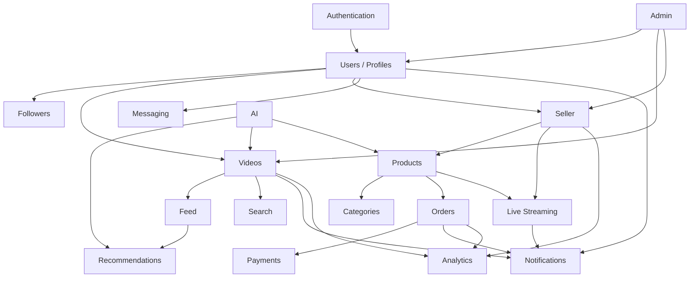

# Module Definitions

Version: 1.0  
Project: LiveCommerce Platform  
Status: Architecture Phase  
Document Owner: Founder & CTO  
Last Updated: 2026-06-27

---

## Purpose

This document defines every business module in the LiveCommerce platform. Each module is an independent domain with clear responsibilities, boundaries, and dependencies.

No module may access another module's database tables directly. Cross-module communication happens via service calls or domain events.

---

## Module Dependency Map

---

## Module Template Reference

Every module below follows this structure:

| Field | Description |
|-------|-------------|
| **Purpose** | Why this module exists |
| **Business Responsibilities** | What it does |
| **Public API** | REST endpoints exposed |
| **Controllers** | HTTP entry points |
| **Services** | Business logic |
| **Repositories** | Data access |
| **Events** | Domain events emitted |
| **Policies** | Authorization rules |
| **Database Tables** | Owned tables |
| **Dependencies** | Other modules required |
| **External Services** | Third-party integrations |
| **Sprint** | When implemented |
| **Acceptance Criteria** | Done definition |

---

## 1. Authentication

**Purpose:** Manage user identity, credentials, sessions, and access tokens.

**Business Responsibilities:**
- User registration (email, phone)
- Login / logout
- JWT access + refresh token lifecycle
- OTP verification via SMS
- Password reset
- Role assignment (user, seller, moderator, admin)

**Public API:** `/api/v1/auth/*`

**Controllers:** `AuthController`

**Services:** `AuthService`

**Repositories:** `UserRepository`, `RefreshTokenRepository`

**Events:** `UserRegistered`

**Policies:** — (auth is pre-policy)

**Database Tables:** `users`, `refresh_tokens`

**Dependencies:** Users (creates user record)

**External Services:** SMS Provider

**Sprint:** 1

**Acceptance Criteria:** Register, login, logout, refresh, OTP, password reset all working with Feature tests.

---

## 2. Users / Profiles

**Purpose:** Manage user account data, profile information, and account settings.

**Business Responsibilities:**
- Profile CRUD (display name, bio, avatar)
- Account settings (locale, notification preferences)
- Account deletion (GDPR anonymization)
- User search
- Role and status management

**Public API:** `/api/v1/me`, `/api/v1/users/{id}`

**Controllers:** `UserController`

**Services:** `ProfileService`

**Repositories:** `UserRepository`, `UserProfileRepository`

**Events:** —

**Policies:** `UserPolicy` (edit own profile, admin manages others)

**Database Tables:** `users`, `user_profiles`

**Dependencies:** Authentication

**External Services:** S3 (avatar upload via Media module)

**Sprint:** 1

**Acceptance Criteria:** Profile view/edit, settings, account deletion, user search working.

---

## 3. Followers (Social Graph)

**Purpose:** Manage follow relationships and social graph between users.

**Business Responsibilities:**
- Follow / unfollow users
- List followers and following
- Block users
- Update follower/following counters

**Public API:** `/api/v1/users/{id}/follow`, `/followers`, `/following`

**Controllers:** `UserController` (social actions)

**Services:** `FollowService`

**Repositories:** `FollowRepository`, `BlockRepository`

**Events:** `UserFollowed`

**Policies:** `UserPolicy` (cannot follow self, blocked users)

**Database Tables:** `follows`, `blocks`

**Dependencies:** Users

**External Services:** —

**Sprint:** 2

**Acceptance Criteria:** Follow, unfollow, block, follower lists with correct counters.

---

## 4. Videos

**Purpose:** Manage short-form video content lifecycle from upload to publication.

**Business Responsibilities:**
- Video upload initiation (pre-signed URL)
- Upload confirmation and metadata
- Video CRUD (title, description, visibility)
- Product tagging on videos
- Like, comment, bookmark
- View count tracking
- Video status lifecycle (uploading → processing → published)

**Public API:** `/api/v1/videos/*`, `/api/v1/bookmarks`

**Controllers:** `VideoController`

**Services:** `VideoService`, `MediaService`

**Repositories:** `VideoRepository`, `CommentRepository`, `BookmarkRepository`

**Events:** `VideoUploaded`, `VideoProcessed`, `VideoLiked`, `CommentCreated`

**Policies:** `VideoPolicy`, `CommentPolicy`

**Database Tables:** `videos`, `video_likes`, `video_products`, `comments`, `bookmarks`, `media_uploads`

**Dependencies:** Users, Media, Products (for tagging)

**External Services:** S3 (storage), CDN (delivery), FFmpeg (transcoding via queue)

**Sprint:** 3

**Acceptance Criteria:** Upload, process, publish, like, comment, bookmark, tag products.

---

## 5. Feed

**Purpose:** Deliver personalized, trending, and following video feeds to users.

**Business Responsibilities:**
- For You feed (personalized)
- Trending feed (velocity + recency)
- Following feed (from followed users)
- Cursor-based pagination
- Feed caching (Redis)

**Public API:** `/api/v1/feed/for-you`, `/feed/trending`, `/feed/following`

**Controllers:** `FeedController`

**Services:** `FeedService` (delegates to RecommendationService)

**Repositories:** `VideoRepository`

**Events:** —

**Policies:** — (public read, following requires auth)

**Database Tables:** — (reads from `videos`, `follows`)

**Dependencies:** Videos, Recommendations, Followers

**External Services:** Redis (cache)

**Sprint:** 3

**Acceptance Criteria:** Three feed types with infinite scroll, < 500ms first page load.

---

## 6. Recommendations

**Purpose:** Rank and recommend videos and products for users.

**Business Responsibilities:**
- Rule-based feed ranking (MVP)
- ML-based ranking (Phase 2)
- Product recommendations based on view/purchase history
- Trending calculation

**Public API:** Internal (consumed by Feed and Product modules)

**Controllers:** — (internal service)

**Services:** `RecommendationService`

**Repositories:** `VideoRepository`, `ProductRepository`

**Events:** `AIRecommendationUpdated` (Phase 2)

**Policies:** —

**Database Tables:** — (reads cross-module; Phase 2: recommendation cache table)

**Dependencies:** Videos, Products, Users, AI (Phase 2)

**External Services:** AI Provider (Phase 2), Redis (cache)

**Sprint:** 3 (rule-based), 9 (ML)

**Acceptance Criteria:** For You feed shows relevant content; trending reflects view velocity.

---

## 7. Products

**Purpose:** Manage product catalog, variants, inventory, and product discovery.

**Business Responsibilities:**
- Product CRUD (seller)
- Variant management (size, color)
- Inventory tracking and stock alerts
- Product images
- Product favorites (wishlist)
- Product search and filtering
- Reviews (verified purchase)

**Public API:** `/api/v1/products/*`, `/api/v1/favorites`

**Controllers:** `ProductController`, `Seller/ProductController`

**Services:** `ProductService`

**Repositories:** `ProductRepository`

**Events:** `ProductCreated`, `ProductOutOfStock`

**Policies:** `ProductPolicy`

**Database Tables:** `products`, `product_images`, `product_variants`, `product_favorites`, `reviews`

**Dependencies:** Categories, Seller (store), Users

**External Services:** S3 (product images)

**Sprint:** 4

**Acceptance Criteria:** Product browse, search, detail, favorites, reviews, seller CRUD.

---

## 8. Categories

**Purpose:** Organize products and content into a hierarchical category tree.

**Business Responsibilities:**
- Category CRUD (admin)
- Category tree (parent-child)
- Category-based product browsing
- Category images

**Public API:** `/api/v1/categories/*`

**Controllers:** `CategoryController`

**Services:** `CategoryService`

**Repositories:** `CategoryRepository`

**Events:** —

**Policies:** Admin-only write

**Database Tables:** `categories`

**Dependencies:** — (standalone)

**External Services:** —

**Sprint:** 4

**Acceptance Criteria:** Category tree displayed, products filterable by category.

---

## 9. Orders

**Purpose:** Manage shopping cart, checkout, and order lifecycle.

**Business Responsibilities:**
- Cart management (add, update, remove)
- Checkout validation (stock, coupon, address)
- Order creation
- Order status lifecycle
- Order history (buyer and seller views)
- Refund request handling

**Public API:** `/api/v1/cart/*`, `/api/v1/orders/*`

**Controllers:** `CartController`, `OrderController`, `Seller/OrderController`

**Services:** `CartService`, `OrderService`

**Repositories:** `CartRepository`, `OrderRepository`

**Events:** `OrderPlaced`, `OrderPaid`, `OrderShipped`, `OrderCancelled`

**Policies:** `OrderPolicy`

**Database Tables:** `carts`, `cart_items`, `orders`, `order_items`, `coupons`, `coupon_usages`

**Dependencies:** Products, Payments, Users, Seller

**External Services:** —

**Sprint:** 4 (cart + basic checkout), 7 (payment integration)

**Acceptance Criteria:** Full cart → checkout → order → status tracking flow.

---

## 10. Payments

**Purpose:** Process payments, handle webhooks, and manage financial transactions.

**Business Responsibilities:**
- Payment initiation (redirect to gateway)
- Webhook processing (signature verification)
- Payment status updates on orders
- Idempotent transaction handling
- Refund processing
- Seller payout tracking (basic)

**Public API:** `/api/v1/webhooks/payment`, payment fields on `/orders`

**Controllers:** `WebhookController`, `OrderController`

**Services:** `PaymentGatewayService`

**Repositories:** `OrderRepository`

**Events:** `OrderPaid` (triggered after webhook)

**Policies:** — (webhook uses signature auth)

**Database Tables:** — (updates `orders.payment_status`, `orders.payment_reference`)

**Dependencies:** Orders

**External Services:** Payment Gateway (Click/Payme/Uzum)

**Sprint:** 7

**Acceptance Criteria:** End-to-end payment with real gateway, webhook processing, refund request.

---

## 11. Seller

**Purpose:** Enable users to become sellers and manage their online store.

**Business Responsibilities:**
- Seller application and approval
- Store profile management
- Seller dashboard (summary analytics)
- Product management (via Products module)
- Order management (via Orders module)
- Seller verification workflow

**Public API:** `/api/v1/seller/*`, `/api/v1/stores/{slug}`

**Controllers:** `Seller/DashboardController`, `Seller/ProductController`, `Seller/OrderController`, `Seller/AnalyticsController`, `StoreController`

**Services:** `StoreService`

**Repositories:** `StoreRepository`

**Events:** `SellerVerified`

**Policies:** `StorePolicy`, seller middleware

**Database Tables:** `stores`

**Dependencies:** Users, Products, Orders, Analytics

**External Services:** —

**Sprint:** 5

**Acceptance Criteria:** Apply, manage store, products, orders, view analytics.

---

## 12. Live Streaming

**Purpose:** Enable real-time live video commerce with product pinning and chat.

**Business Responsibilities:**
- Start/end live streams
- Streaming provider token generation
- Product pinning during stream
- Live chat (REST + polling)
- Viewer count tracking
- Active stream discovery
- Notify followers when stream starts

**Public API:** `/api/v1/live/*`

**Controllers:** `LiveStreamController`

**Services:** `LiveStreamService`

**Repositories:** `LiveStreamRepository`

**Events:** `LiveStreamStarted`, `LiveStreamEnded`

**Policies:** `LiveStreamPolicy`

**Database Tables:** `live_streams`, `live_stream_products`, `live_chat_messages`

**Dependencies:** Seller, Products, Notifications

**External Services:** Agora (streaming provider)

**Sprint:** 6

**Acceptance Criteria:** Go live, watch, chat, pin products, add to cart during stream.

---

## 13. Messaging

**Purpose:** Enable direct communication between buyers and sellers.

**Business Responsibilities:**
- Create conversations (buyer ↔ seller)
- Send/receive text and image messages
- Order-linked conversations
- Unread message tracking
- Block enforcement

**Public API:** `/api/v1/conversations/*`

**Controllers:** `ConversationController`

**Services:** `MessagingService`

**Repositories:** `ConversationRepository`, `MessageRepository`

**Events:** `MessageSent`

**Policies:** `ConversationPolicy`

**Database Tables:** `conversations`, `messages`, `conversation_participants`

**Dependencies:** Users, Orders, Notifications

**External Services:** FCM (push for new messages)

**Sprint:** 8

**Acceptance Criteria:** Start conversation, send/receive messages, order-linked chat.

---

## 14. Notifications

**Purpose:** Deliver in-app and push notifications for platform events.

**Business Responsibilities:**
- Create in-app notifications
- Send push notifications via FCM
- Device token management
- Notification preferences enforcement
- Mark as read / mark all as read
- Unread count

**Public API:** `/api/v1/notifications/*`, `/api/v1/devices`

**Controllers:** `NotificationController`, `DeviceController`

**Services:** `NotificationService`

**Repositories:** `NotificationRepository`, `UserDeviceRepository`

**Events:** `NotificationSent` (internal tracking)

**Policies:** User owns own notifications

**Database Tables:** `notifications`, `user_devices`

**Dependencies:** Users

**External Services:** FCM (Firebase Cloud Messaging)

**Sprint:** 2 (basic), enhanced in later sprints

**Acceptance Criteria:** Push + in-app notifications for follow, like, comment, order, live stream.

---

## 15. Analytics

**Purpose:** Provide business, creator, and seller analytics dashboards.

**Business Responsibilities:**
- Seller revenue and order analytics
- Creator video performance metrics
- Platform-wide metrics (admin)
- Daily/weekly/monthly aggregation
- Report export (CSV)

**Public API:** `/api/v1/seller/analytics/*`, admin analytics endpoints

**Controllers:** `Seller/AnalyticsController`, `Admin/AnalyticsController`

**Services:** `AnalyticsService`

**Repositories:** Cross-module read queries

**Events:** —

**Policies:** Seller sees own data; admin sees all

**Database Tables:** `analytics_events` (Phase 2), reads from existing tables

**Dependencies:** Orders, Videos, Users, Seller

**External Services:** —

**Sprint:** 12

**Acceptance Criteria:** Seller dashboard charts, creator metrics, admin overview.

---

## 16. Admin

**Purpose:** Platform administration, moderation, and configuration.

**Business Responsibilities:**
- User management (suspend, ban)
- Seller verification/approval
- Content moderation queue
- Category management
- Platform configuration
- Audit log viewing
- Report handling

**Public API:** `/api/v1/admin/*`

**Controllers:** `Admin/*Controller`

**Services:** `AdminService`, `ModerationService`

**Repositories:** Cross-module

**Events:** —

**Policies:** Admin/Moderator role required

**Database Tables:** `audit_logs` (reads all tables)

**Dependencies:** All modules

**External Services:** — (admin panel is web)

**Sprint:** 14

**Acceptance Criteria:** Admin can manage users, moderate content, approve sellers, view audit logs.

---

## 17. AI

**Purpose:** Provide AI-powered features via adapter pattern without coupling core logic.

**Business Responsibilities:**
- Content moderation (video, comments)
- Feed ranking (ML)
- Product description/title generation
- Subtitle generation and translation
- Thumbnail selection
- Price recommendations
- Seller assistant chat
- Fraud detection (Phase 3)

**Public API:** Internal + `/api/v1/ai/*` (Phase 2)

**Controllers:** `AiController` (Phase 2)

**Services:** `AiService`

**Repositories:** AI output storage tables

**Events:** Consumes `VideoUploaded`, `OrderPlaced`; emits `AIRecommendationUpdated`

**Policies:** —

**Database Tables:** AI results cached in entity tables or dedicated cache

**Dependencies:** Videos, Products, Recommendations

**External Services:** OpenAI / local ML (via AiProviderInterface)

**Sprint:** 9–11

**Acceptance Criteria:** AI adapter swappable, all AI async, failures graceful.

---

## 18. Search

**Purpose:** Global search across videos, products, users, and hashtags.

**Business Responsibilities:**
- Full-text search (PostgreSQL MVP)
- Search suggestions/autocomplete
- Trending searches
- Recent search history
- Filter by type (videos, products, users)

**Public API:** `/api/v1/search`, `/api/v1/search/suggestions`

**Controllers:** `SearchController`

**Services:** `SearchService`

**Repositories:** Cross-module search queries

**Events:** —

**Policies:** — (public read)

**Database Tables:** — (reads from `videos`, `products`, `users`)

**Dependencies:** Videos, Products, Users

**External Services:** Elasticsearch (Phase 2)

**Sprint:** 2 (user search), 3–4 (video/product search)

**Acceptance Criteria:** Global search returns relevant results across entity types.

---

## Module Boundary Rules

1. **No direct cross-module table access.** Module A reads Module B's data only through Module B's Repository or Service.
2. **Side effects via events.** Module A notifies Module B of changes via domain events, not direct calls (except synchronous reads).
3. **Shared code in core/shared.** Utilities used by 3+ modules go in `core/` (mobile) or shared service classes (backend).
4. **External services behind interfaces.** Every third-party integration has an adapter interface.
5. **One owner per table.** Each database table belongs to exactly one module.

---

## Document Revision History

| Version | Date | Author | Changes |
|---------|------|--------|---------|
| 1.0 | 2026-06-27 | Founder & CTO | Initial module definitions for 18 modules |

---

**Related Documents:** [Master Plan](./12_MASTER_PLAN.md) · [System Architecture](./docs/02_SYSTEM_ARCHITECTURE.md) · [Event Flow](./09_EVENT_FLOW.md)
