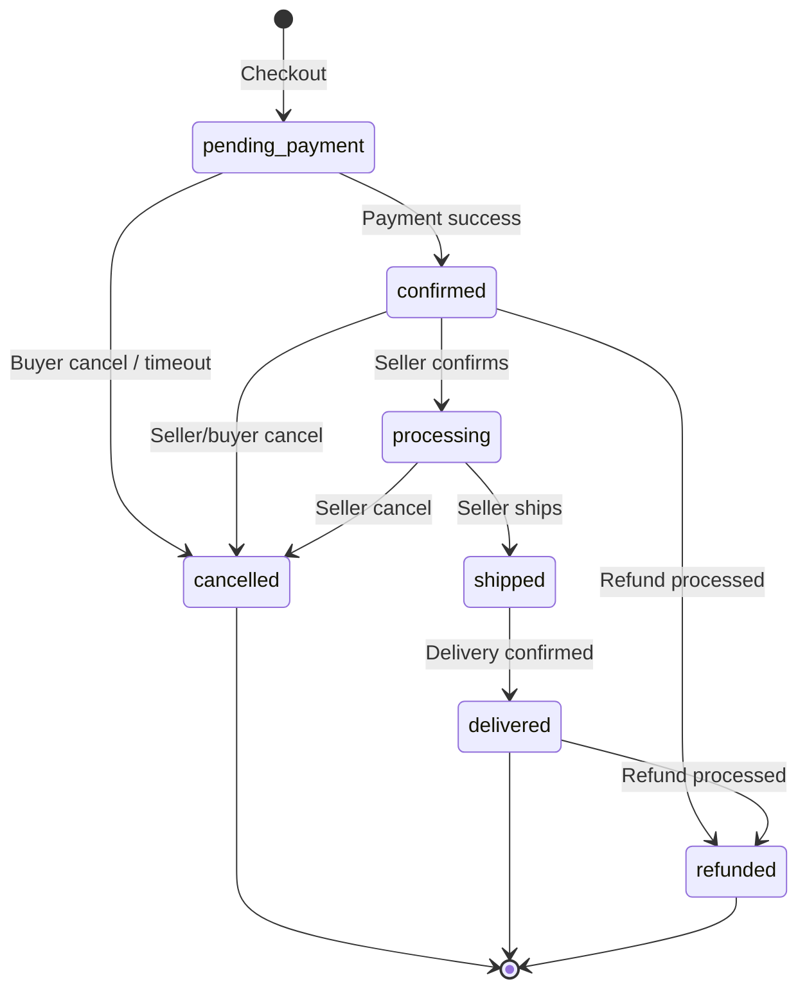
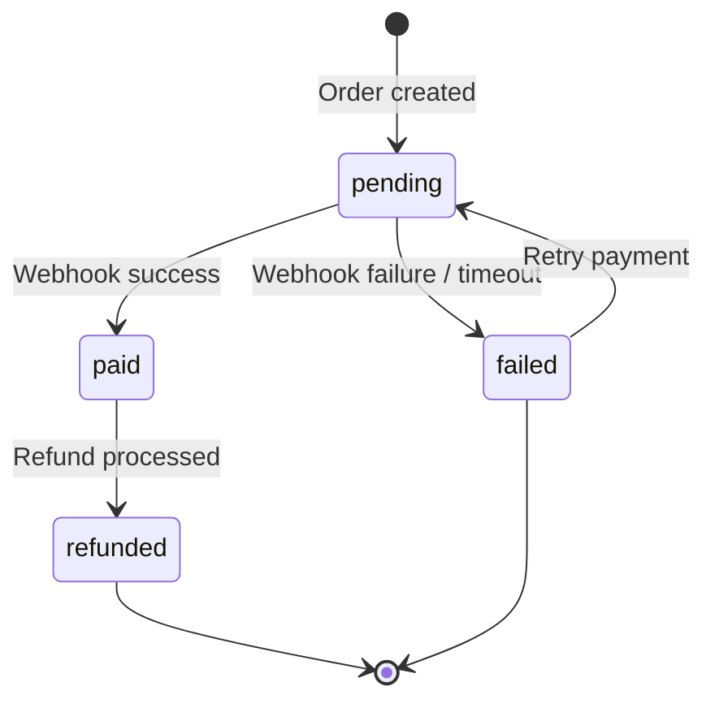
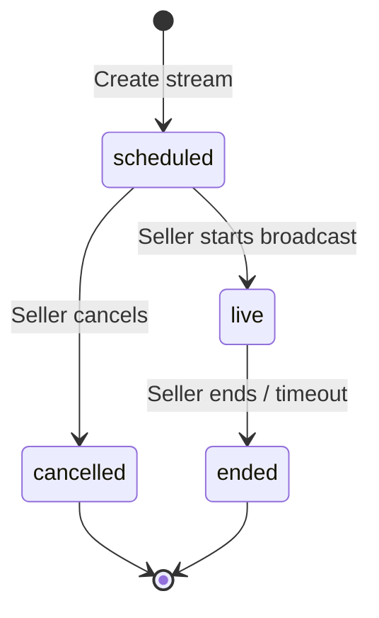
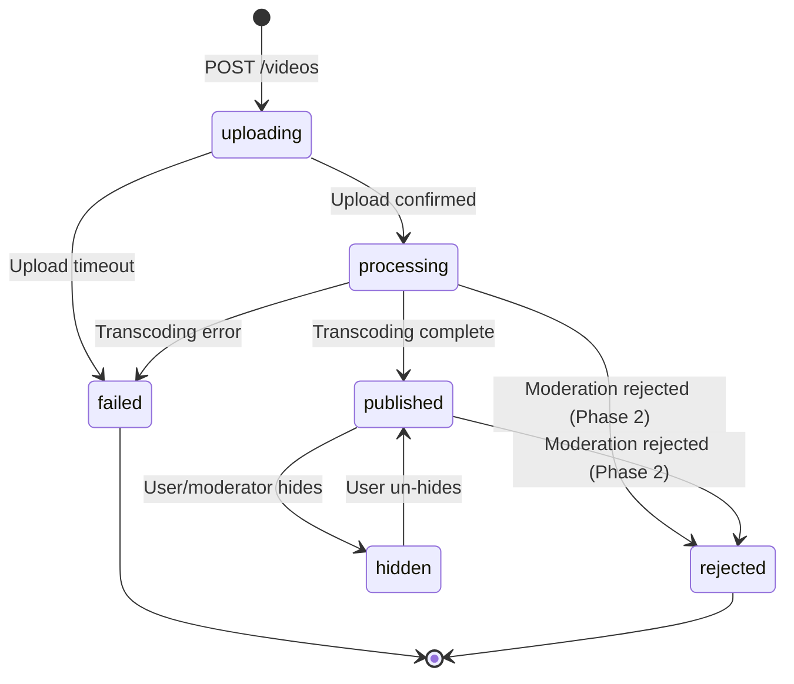
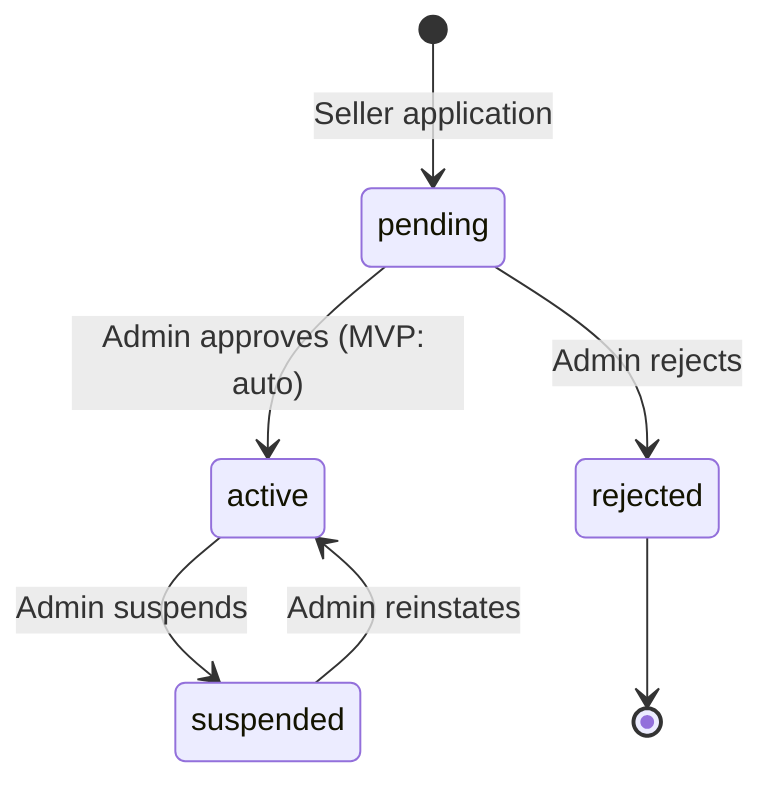
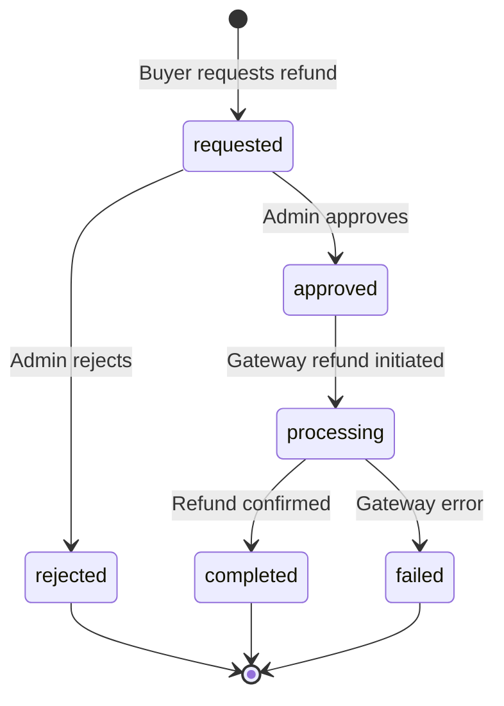
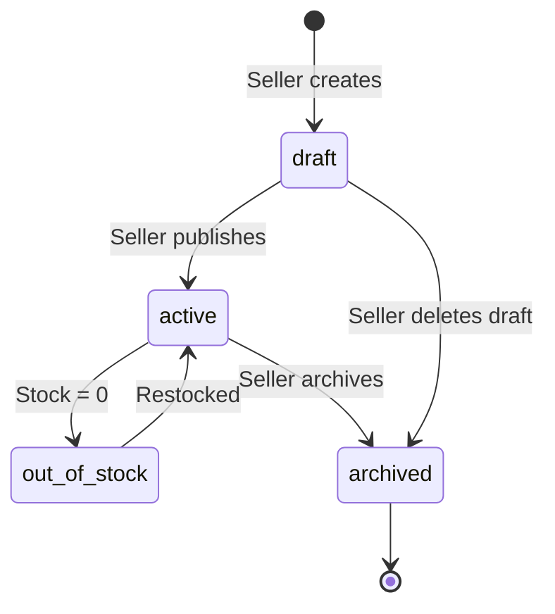
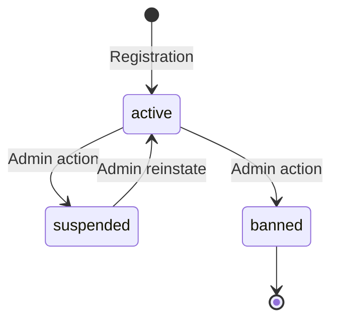

# State Machines

Version: 1.0  
Project: LiveCommerce Platform  
Status: Architecture Phase  
Document Owner: Founder & CTO  
Last Updated: 2026-06-27

---

## Purpose

Define lifecycle states for every entity that changes over time. No entity may transition between states without documented rules.

State machines eliminate invalid transitions, simplify business logic, and improve reliability.

---

## Goals

- Eliminate invalid state transitions at the service layer
- Centralize transition rules (not scattered in controllers)
- Enable clear audit trails per transition
- Simplify testing (test each transition explicitly)

---

## Implementation Rules

1. State transitions are enforced in the **Service layer**.
2. Invalid transitions throw `InvalidStateTransitionException`.
3. Every transition is logged to `audit_logs` for financial and admin entities.
4. Transition methods are named `{verb}()` — e.g., `OrderService::ship()`.
5. Timeout rules are enforced by **scheduled commands** (Laravel Scheduler).

---

## State Machine Template

| Field | Description |
|-------|-------------|
| **Entity** | Database table / model |
| **States** | All possible states |
| **Initial State** | State on creation |
| **Terminal States** | States with no outgoing transitions |
| **Transitions** | Allowed from → to with trigger |
| **Forbidden** | Explicitly blocked transitions |
| **Actor** | Who can trigger (user, seller, admin, system) |
| **Business Rules** | Conditions required for transition |
| **Timeout Rules** | Auto-transitions after time |

---

## 1. Order

**Entity:** `orders.status`

| From | To | Trigger | Actor | Business Rules |
|------|----|---------|-------|----------------|
| — | `pending_payment` | Checkout | Buyer | Cart not empty, stock available, valid address |
| `pending_payment` | `confirmed` | Payment webhook | System | Payment verified, signature valid |
| `pending_payment` | `cancelled` | Cancel / timeout | Buyer, System | Not yet paid |
| `confirmed` | `processing` | Seller confirms | Seller | Order belongs to seller's store |
| `processing` | `shipped` | Mark shipped | Seller | Tracking info optional |
| `shipped` | `delivered` | Delivery confirmed | System, Buyer | Auto-confirm after 14 days |
| `confirmed` | `cancelled` | Cancel | Buyer, Seller, Admin | Before shipping |
| `processing` | `cancelled` | Cancel | Seller, Admin | Before shipping |
| `confirmed` | `refunded` | Refund | Admin | Payment was completed |
| `delivered` | `refunded` | Refund | Admin | Within refund window (30 days) |

**Forbidden:** `shipped → cancelled`, `delivered → cancelled`, `refunded → any`, `cancelled → any`

**Timeout Rules:**
- `pending_payment` → `cancelled` after **30 minutes** (scheduled job)
- `shipped` → `delivered` after **14 days** if buyer does not dispute (scheduled job)

---

## 2. Payment

**Entity:** `orders.payment_status`

| From | To | Trigger | Actor | Business Rules |
|------|----|---------|-------|----------------|
| — | `pending` | Order created | System | Payment initiated with gateway |
| `pending` | `paid` | Webhook | System | Signature verified, amount matches |
| `pending` | `failed` | Webhook / timeout | System | Gateway rejected or 30 min timeout |
| `paid` | `refunded` | Refund webhook | System, Admin | Refund approved |
| `failed` | `pending` | Retry payment | Buyer | Order still `pending_payment` |

**Forbidden:** `paid → failed`, `paid → pending`, `refunded → any`

**Timeout Rules:**
- `pending` → `failed` after **30 minutes** if no webhook received

---

## 3. Live Stream

**Entity:** `live_streams.status`

| From | To | Trigger | Actor | Business Rules |
|------|----|---------|-------|----------------|
| — | `scheduled` | POST /live/start | Seller | Active store, seller role |
| `scheduled` | `live` | Provider confirms broadcast | System | Publisher token used |
| `scheduled` | `cancelled` | Cancel before start | Seller | Not yet live |
| `live` | `ended` | POST /live/{id}/end | Seller, System | Stream was active |

**Forbidden:** `ended → live`, `cancelled → live`, `ended → any`

**Timeout Rules:**
- `live` → `ended` after **4 hours** maximum stream duration (auto-end)
- `scheduled` → `cancelled` after **30 minutes** if seller never starts

---

## 4. Video Processing

**Entity:** `videos.status`

| From | To | Trigger | Actor | Business Rules |
|------|----|---------|-------|----------------|
| — | `uploading` | Create video | User | Valid metadata |
| `uploading` | `processing` | Confirm upload | User, System | File exists in S3 |
| `uploading` | `failed` | Upload timeout | System | No file after 1 hour |
| `processing` | `published` | Transcoding done | System | HLS + thumbnail generated |
| `processing` | `rejected` | Moderation | System, Moderator | Phase 2 AI moderation |
| `processing` | `failed` | Transcoding error | System | Retry 3 times first |
| `published` | `hidden` | Hide | User, Moderator | Owner or admin |
| `hidden` | `published` | Unhide | User, Admin | Owner or admin |

**Forbidden:** `published → uploading`, `failed → any`, `rejected → any`

**Timeout Rules:**
- `uploading` → `failed` after **1 hour** without confirm
- `processing` → `failed` after **30 minutes** without completion (retry first)

---

## 5. Seller Verification

**Entity:** `stores.status` + `users.role`

| From | To | Trigger | Actor | Business Rules |
|------|----|---------|-------|----------------|
| — | `pending` | POST /seller/apply | User | No existing store |
| `pending` | `active` | Approve | Admin, System (MVP auto) | Valid application |
| `pending` | `rejected` | Reject | Admin | Reason provided |
| `active` | `suspended` | Suspend | Admin, Moderator | Policy violation |
| `suspended` | `active` | Reinstate | Admin | Suspension lifted |

**Forbidden:** `rejected → active`, `active → pending`

**Side Effects:**
- `pending → active`: Set `users.role = seller`, dispatch `SellerVerified`
- `active → suspended`: Hide store products, notify seller

---

## 6. Refund

**Entity:** Refund request (`refund_requests` table)

| From | To | Trigger | Actor | Business Rules |
|------|----|---------|-------|----------------|
| — | `requested` | POST /orders/{id}/refund | Buyer | Order is paid/delivered, within 30 days |
| `requested` | `approved` | Admin review | Admin | Valid reason |
| `requested` | `rejected` | Admin review | Admin | Invalid reason |
| `approved` | `processing` | Initiate gateway refund | System | Payment reference exists |
| `processing` | `completed` | Refund webhook | System | Gateway confirms |
| `processing` | `failed` | Gateway error | System | Retry 3 times |

**Forbidden:** `completed → any`, `rejected → approved`

**Side Effects:**
- `completed`: Order status → `refunded`, payment_status → `refunded`, restore inventory

---

## 7. Shipment

**Entity:** Shipment tracking (fields on `orders`: `shipped_at`, `delivered_at`)

| State | Condition | Description |
|-------|-----------|-------------|
| `not_shipped` | `shipped_at IS NULL` | Order confirmed/processing, not yet shipped |
| `shipped` | `shipped_at IS NOT NULL, delivered_at IS NULL` | In transit |
| `delivered` | `delivered_at IS NOT NULL` | Delivered to buyer |

| From | To | Trigger | Actor |
|------|----|---------|-------|
| `not_shipped` | `shipped` | Seller marks shipped | Seller |
| `shipped` | `delivered` | Buyer confirms / auto-timeout | Buyer, System |

**Timeout:** `shipped → delivered` after **14 days** (auto-confirm)

---

## 8. User Verification

**Entity:** `users` (email_verified_at, phone_verified_at, is_verified)

| State | Condition | Description |
|-------|-----------|-------------|
| `unverified` | No email or phone verified | Limited access |
| `email_verified` | email_verified_at set | Email confirmed |
| `phone_verified` | phone_verified_at set | Phone OTP confirmed |
| `verified` | is_verified = true | Platform verified badge (admin granted) |

| From | To | Trigger | Actor |
|------|----|---------|-------|
| `unverified` | `email_verified` | Email confirmation link | User |
| `unverified` | `phone_verified` | OTP verification | User |
| any | `verified` | Admin grants badge | Admin |

**Business Rules:**
- Phone registration requires OTP before full access
- Email registration requires email confirmation (optional for MVP browse)

---

## 9. Product Moderation

**Entity:** `products.status` + moderation (Phase 2)

| From | To | Trigger | Actor | Business Rules |
|------|----|---------|-------|----------------|
| — | `draft` | Create product | Seller | — |
| `draft` | `active` | Publish | Seller | Has title, price, at least 1 image |
| `active` | `out_of_stock` | Stock reaches 0 | System | Auto on order or manual |
| `out_of_stock` | `active` | Restock | Seller | stock_quantity > 0 |
| `active` | `archived` | Archive | Seller, Admin | — |
| `draft` | `archived` | Delete draft | Seller | — |

**Forbidden:** `archived → active` (must create new product)

**Phase 2 Addition:** `active → under_review → active/rejected` via AI moderation

---

## 10. Notification Delivery

**Entity:** Notification delivery tracking

| State | Condition | Description |
|-------|-----------|-------------|
| `created` | Notification record inserted | In-app notification exists |
| `push_queued` | SendPushNotificationJob dispatched | Waiting for FCM |
| `push_sent` | FCM accepted | Push delivered to device |
| `push_failed` | FCM rejected | Token invalid or error |
| `read` | read_at set | User viewed notification |

| From | To | Trigger | Actor |
|------|----|---------|-------|
| — | `created` | Event listener | System |
| `created` | `push_queued` | Job dispatched | System |
| `push_queued` | `push_sent` | FCM success | System |
| `push_queued` | `push_failed` | FCM failure | System |
| any | `read` | User opens notification | User |

**Failure Handling:**
- `push_failed`: Deactivate `user_devices` token if FCM returns invalid token
- In-app notification persists regardless of push status

---

## User Account Status

**Entity:** `users.status` (supplementary to above)

| From | To | Actor | Effect |
|------|----|-------|--------|
| — | `active` | System | Full access |
| `active` | `suspended` | Admin, Moderator | Read-only, cannot post/buy |
| `active` | `banned` | Admin | No access, tokens revoked |
| `suspended` | `active` | Admin | Access restored |

**Forbidden:** `banned → any`, `suspended → banned` (must reinstate first)

---

## Document Revision History

| Version | Date | Author | Changes |
|---------|------|--------|---------|
| 1.0 | 2026-06-27 | Founder & CTO | Initial state machines for 10 entities |

---

**Related Documents:** [Event Flow](./09_EVENT_FLOW.md) · [Database Design](./docs/03_DATABASE_DESIGN.md) · [Modules](./08_MODULES.md)
