# System Architecture

Version: 1.0  
Project: LiveCommerce Platform  
Status: Architecture Phase — Approved for Implementation Planning  
Document Owner: Founder & CTO  
Last Updated: 2026-06-27

---

## Document Purpose

This document defines the system architecture for the LiveCommerce platform. It is the authoritative reference for all architectural decisions during the Architecture Phase and beyond.

All future implementation must strictly follow this document, the PRD, and the Database Design and API Specification documents.

**No production code should be written until this document and its companion engineering documents are reviewed and accepted.**

---

## Table of Contents

1. [Architecture Principles](#1-architecture-principles)
2. [High-Level Architecture](#2-high-level-architecture)
3. [Mobile Architecture](#3-mobile-architecture)
4. [Backend Architecture](#4-backend-architecture)
5. [Infrastructure](#5-infrastructure)
6. [Services](#6-services)
7. [Event Flow](#7-event-flow)
8. [AI Integration](#8-ai-integration)
9. [Streaming Architecture](#9-streaming-architecture)
10. [Security Architecture](#10-security-architecture)
11. [Scalability Strategy](#11-scalability-strategy)
12. [Document Revision History](#12-document-revision-history)

---

## 1. Architecture Principles

| Principle | Description |
|-----------|-------------|
| **Mobile First** | Primary client is Flutter (Android/iOS). Desktop is out of MVP scope. |
| **API First** | Backend exposes versioned REST API. Mobile is the primary consumer. |
| **Clean Architecture** | Business logic is isolated from frameworks on both mobile and backend. |
| **Provider Abstraction** | Third-party services (streaming, payments, AI) are behind interfaces. |
| **Async by Default** | Heavy work (video processing, notifications, emails) runs in queues. |
| **Stateless API** | API servers hold no session state. JWT + Redis for auth and cache. |
| **Event-Driven Side Effects** | Domain events decouple core logic from notifications, analytics, and AI. |
| **Scale Horizontally** | All stateless components can be replicated behind a load balancer. |

---

## 2. High-Level Architecture

### 2.1 System Context

The LiveCommerce platform is a mobile-first live commerce ecosystem. Users watch short-form and live video content, discover products, and purchase without leaving the app. Sellers create content, manage stores, and sell through video and live streams.

### 2.2 High-Level Diagram

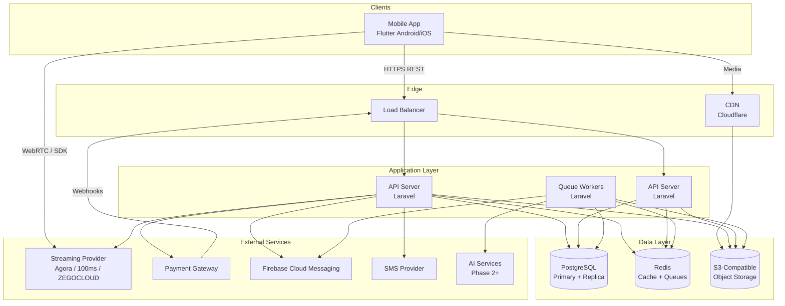

### 2.3 Request Lifecycle

1. Mobile app sends HTTPS request to load balancer.
2. Load balancer routes to an available API server.
3. Middleware handles authentication, rate limiting, and locale.
4. Controller validates input via Form Request and delegates to Service.
5. Service executes business logic via Repositories.
6. Service dispatches Events or Jobs for side effects.
7. Controller returns JSON Resource response.
8. Mobile app renders response in Presentation layer.

### 2.4 Component Responsibilities

| Component | Responsibility |
|-----------|----------------|
| Mobile App | UI, local cache, media playback, streaming SDK integration |
| Load Balancer | TLS termination, request distribution, health checks |
| API Server | REST API, authentication, business orchestration |
| Queue Workers | Async jobs: video processing, notifications, emails, AI tasks |
| PostgreSQL | Persistent relational data, transactions, audit logs |
| Redis | Cache, session tokens, rate limiting, queue backend |
| S3 + CDN | Video, image, and static asset storage and delivery |
| Streaming Provider | Real-time live video ingest and playback |
| Payment Gateway | Payment processing and webhook callbacks |
| FCM | Push notification delivery to mobile devices |

---

## 3. Mobile Architecture

### 3.1 Architecture Pattern

The mobile app follows **Clean Architecture** with **Riverpod** for state management.

Dependency rule: inner layers never depend on outer layers.

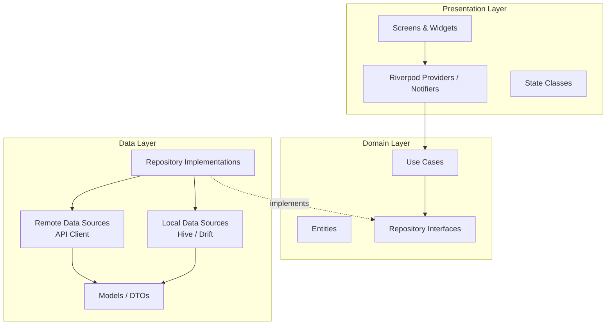

### 3.2 Layer Responsibilities

| Layer | Contents | Rules |
|-------|----------|-------|
| **Presentation** | Screens, widgets, providers, state | May depend on Domain only. No direct API calls. |
| **Domain** | Entities, use cases, repository interfaces | Pure Dart. No Flutter, no HTTP, no platform imports. |
| **Data** | Repositories, API client, local DB, DTOs | Implements Domain interfaces. Maps DTOs to Entities. |

### 3.3 Feature Module Structure

Each feature is self-contained:

```
features/{feature_name}/
├── data/
│   ├── datasources/
│   ├── models/
│   └── repositories/
├── domain/
│   ├── entities/
│   ├── repositories/
│   └── usecases/
└── presentation/
    ├── providers/
    ├── screens/
    └── widgets/
```

### 3.4 Core Mobile Modules

| Module | Purpose |
|--------|---------|
| `core/network` | HTTP client (Dio), interceptors (auth, logging), error mapping |
| `core/storage` | Secure token storage, Hive/Drift setup |
| `core/router` | GoRouter navigation, deep links |
| `core/theme` | Light/dark theme, design tokens |
| `core/l10n` | Localization (Uzbek, Russian) |
| `shared/widgets` | Reusable UI components (buttons, loaders, video player shell) |

### 3.5 Offline Strategy

| Data | Strategy |
|------|----------|
| Auth tokens | Secure storage (flutter_secure_storage) |
| Feed videos (recent) | Cache metadata + thumbnail locally; stream video on demand |
| Cart | Sync with server; local cache for offline viewing |
| User profile | Cache last fetched profile |
| Product catalog | Cache recently viewed products |

Offline mode is read-only for MVP. Write operations (checkout, upload) require connectivity.

### 3.6 Mobile ↔ Backend Communication

- All API calls go through a centralized `ApiClient` with JWT interceptor.
- Access token refresh is handled transparently on 401 responses.
- Media uploads use pre-signed S3 URLs obtained from the backend.
- Live streaming uses the provider SDK directly; backend provides tokens and channel IDs.

---

## 4. Backend Architecture

### 4.1 Architecture Pattern

The backend follows **Layered Clean Architecture** with **Repository Pattern** and **Service Layer**.

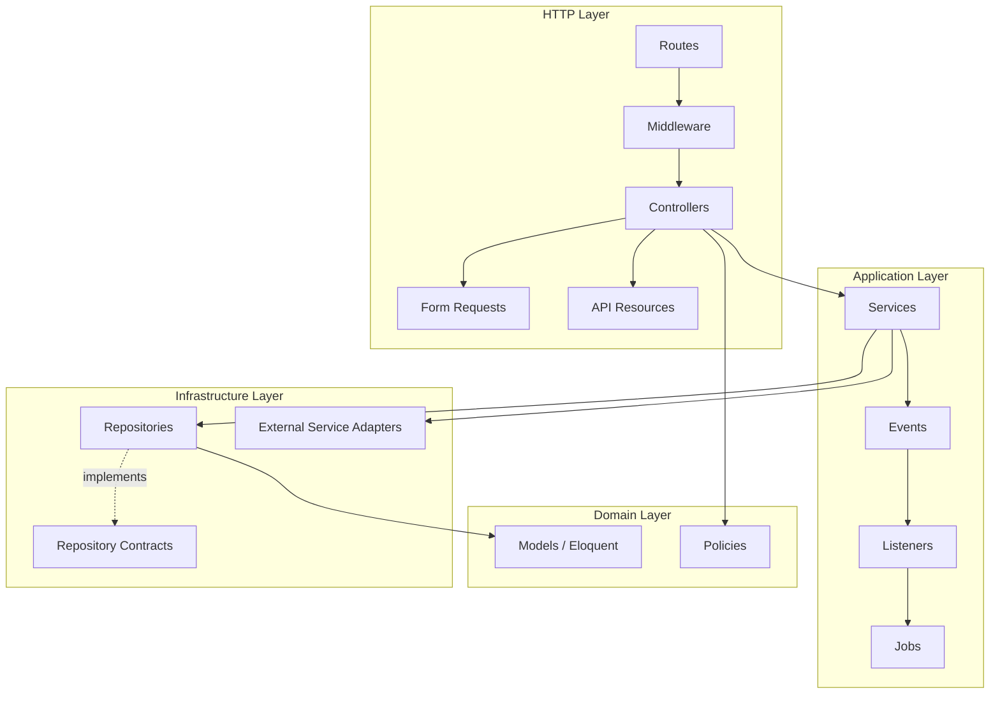

### 4.2 Layer Rules

| Layer | Allowed | Forbidden |
|-------|---------|-----------|
| **Controllers** | Request/response handling, calling services | Business logic, direct DB queries |
| **Form Requests** | Validation, authorization checks | Business logic |
| **Services** | Business logic, orchestration, event dispatch | HTTP concerns, direct response formatting |
| **Repositories** | Database queries, model persistence | Business rules |
| **Models** | Relationships, scopes, casts, accessors | Business logic |
| **Jobs** | Async task execution | Synchronous user-facing logic |
| **Policies** | Authorization per action | Business logic |

### 4.3 Backend Module Map

| Module | Service | Repository | Key Models |
|--------|---------|------------|------------|
| Auth | AuthService | UserRepository | User, RefreshToken |
| Profile | ProfileService | UserRepository | User, UserProfile |
| Social | FollowService | FollowRepository | Follow |
| Video | VideoService | VideoRepository | Video, VideoLike, Comment, Bookmark |
| Product | ProductService | ProductRepository | Product, ProductImage, ProductVariant, Category |
| Cart | CartService | CartRepository | Cart, CartItem |
| Order | OrderService | OrderRepository | Order, OrderItem |
| Store | StoreService | StoreRepository | Store |
| Live | LiveStreamService | LiveStreamRepository | LiveStream, LiveChatMessage |
| Notification | NotificationService | NotificationRepository | Notification, UserDevice |
| Search | SearchService | SearchRepository | — (cross-model queries) |
| Recommendation | RecommendationService | — | — (Redis + rules, ML in Phase 2) |
| Media | MediaService | — | — (S3 adapter) |
| Payment | PaymentService | — | — (gateway adapter) |

### 4.4 Dependency Injection

All services and repositories are bound via Laravel Service Provider using interfaces:

```
App\Contracts\Repositories\VideoRepositoryInterface
  → App\Repositories\Eloquent\VideoRepository

App\Contracts\Services\StreamingProviderInterface
  → App\Services\LiveStream\Providers\AgoraProvider
```

Controllers and services receive dependencies via constructor injection. No static calls or facades inside services.

---

## 5. Infrastructure

### 5.1 Environment Topology

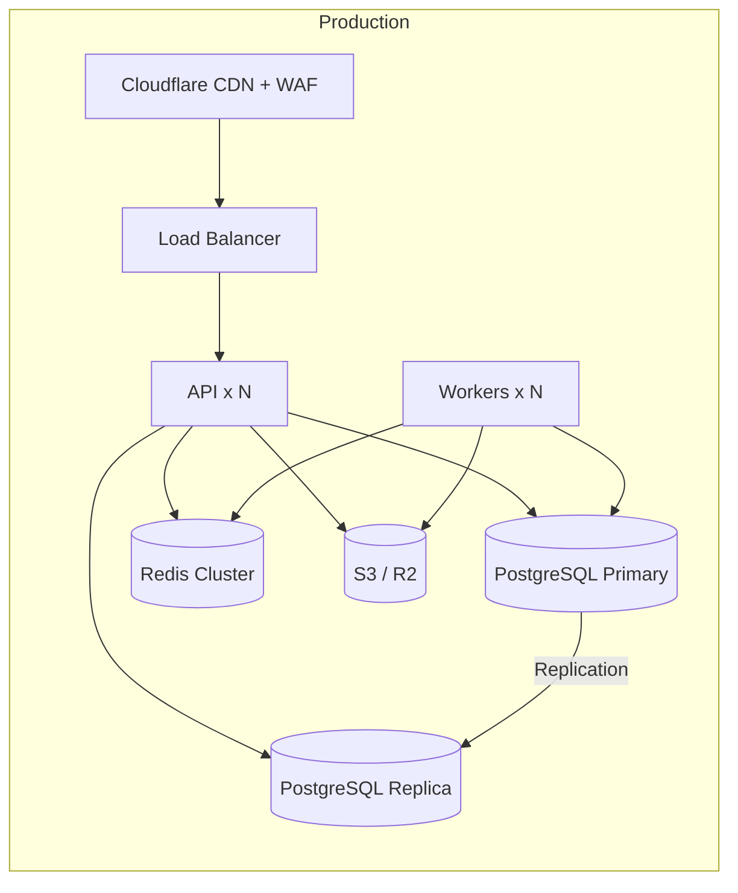

### 5.2 Environment Definitions

| Environment | Purpose | Infrastructure |
|-------------|---------|----------------|
| **local** | Developer machines | Docker Compose (Postgres, Redis, MinIO, Nginx, PHP) |
| **staging** | QA, demos, integration testing | Mirrors production at reduced scale |
| **production** | Live users | Multi-AZ, auto-scaling, managed Postgres, Redis cluster |

### 5.3 Infrastructure Components

| Component | Technology | Purpose |
|-----------|------------|---------|
| CDN | Cloudflare | Static asset and video delivery, DDoS protection, WAF |
| Load Balancer | Cloud provider LB / Nginx | TLS termination, health checks, routing |
| API Servers | Laravel (PHP 8.4+) on Docker/K8s | REST API |
| Queue Workers | Laravel Horizon | Background job processing |
| Database | PostgreSQL 16+ | Primary data store |
| Read Replica | PostgreSQL | Read-heavy queries (feed, search, analytics) |
| Cache / Queue | Redis 7+ | Cache, sessions, rate limits, job queues |
| Object Storage | Cloudflare R2 / AWS S3 | Videos, images, uploads |
| Monitoring | Sentry + health checks | Error tracking, uptime |
| CI/CD | GitHub Actions | Build, test, deploy pipeline |

### 5.4 Network & Security Boundaries

- All external traffic enters through CDN/WAF → Load Balancer.
- API servers are in a private subnet; only LB has public access.
- Database and Redis are in a private subnet; accessible only by API and workers.
- S3 bucket is private; access via pre-signed URLs and CDN origin auth.
- Payment webhooks validated by signature before processing.

### 5.5 Deployment Units

| Unit | Scaling Trigger | Min (Prod) |
|------|-----------------|------------|
| API Server | CPU > 70% or request latency p95 > 300ms | 2 |
| Queue Worker | Queue depth > 1000 | 2 |
| PostgreSQL | Connection count / query load | 1 primary + 1 replica |
| Redis | Memory > 80% | 1 (cluster in Phase 2) |

---

## 6. Services

### 6.1 Service Catalog

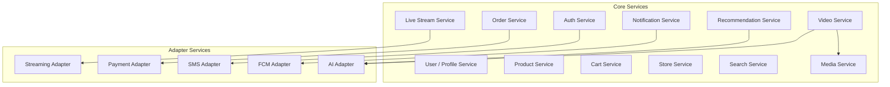

### 6.2 Service Descriptions

#### Auth Service
- Registration, login, logout, token refresh
- OTP verification via SMS adapter
- Password reset
- Role assignment (user, seller, moderator, admin)

#### Video Service
- Video upload initiation (pre-signed URL)
- Video metadata CRUD
- Like, comment, bookmark
- Product tagging on videos
- View count tracking (debounced via Redis)

#### Product Service
- Product CRUD (seller)
- Category management
- Variant and inventory management
- Product search and filtering

#### Order Service
- Cart management
- Checkout orchestration
- Order creation and status lifecycle
- Refund request handling
- Payment webhook processing

#### Live Stream Service
- Stream session creation and teardown
- Provider token generation
- Product pinning during stream
- Live chat message persistence
- Viewer count (via provider webhook or polling)

#### Notification Service
- In-app notification creation
- Push notification dispatch via FCM
- Notification preferences enforcement
- Batch mark-as-read

#### Recommendation Service (MVP: Rule-Based)
- Trending feed (view velocity + recency)
- For You feed (follow graph + category affinity + watch history)
- Product recommendations (purchase and view history)
- Phase 2: ML model integration via AI Adapter

#### Media Service
- Pre-signed URL generation for uploads
- Upload confirmation and metadata recording
- Video transcoding job dispatch
- CDN URL generation

---

## 7. Event Flow

### 7.1 Event-Driven Architecture

Domain events decouple core business logic from side effects. Events are dispatched synchronously; listeners may queue jobs for async work.

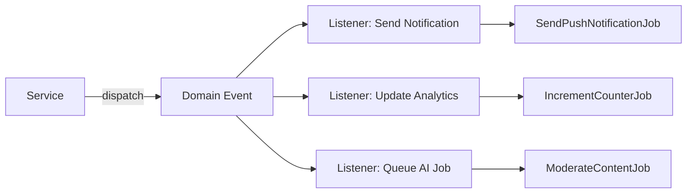

### 7.2 Core Domain Events

| Event | Trigger | Listeners / Jobs |
|-------|---------|------------------|
| `UserRegistered` | New account created | Send welcome notification, create default profile |
| `UserFollowed` | Follow action | Notify followed user |
| `VideoUploaded` | Upload confirmed | Queue video transcoding, queue moderation (Phase 2) |
| `VideoProcessed` | Transcoding complete | Update video status, notify uploader |
| `VideoLiked` | Like action | Notify video owner, increment counter |
| `CommentCreated` | New comment | Notify video owner |
| `OrderPlaced` | Checkout completed | Notify buyer and seller, decrement inventory, send email |
| `OrderPaid` | Payment webhook confirmed | Update order status, notify parties |
| `OrderShipped` | Seller marks shipped | Notify buyer |
| `LiveStreamStarted` | Seller goes live | Notify followers via push |
| `LiveStreamEnded` | Stream ended | Update stream record, queue replay processing (Phase 1.1) |
| `ProductOutOfStock` | Inventory reaches 0 | Notify seller, hide from active listings |

### 7.3 Video Upload Flow

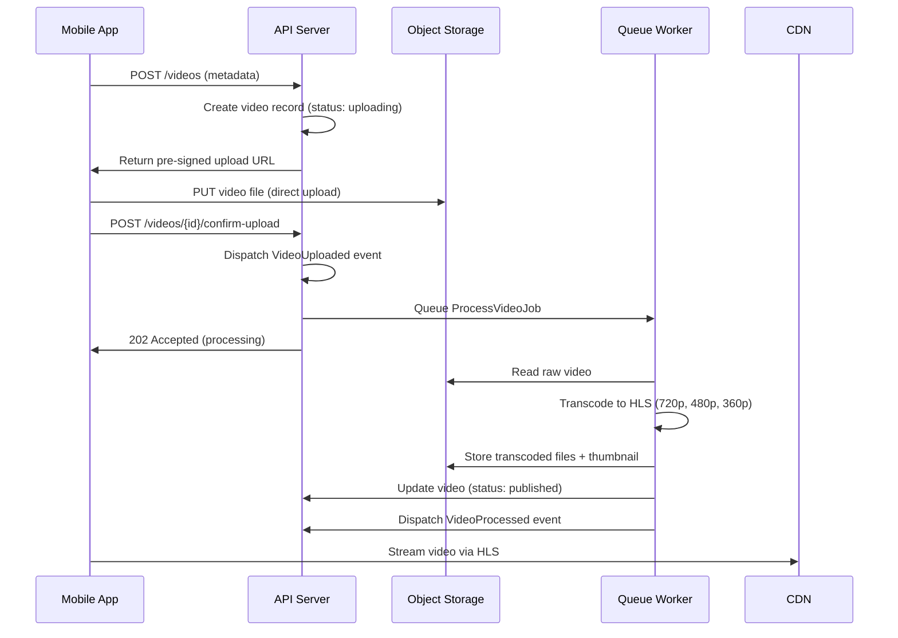

### 7.4 Order Checkout Flow

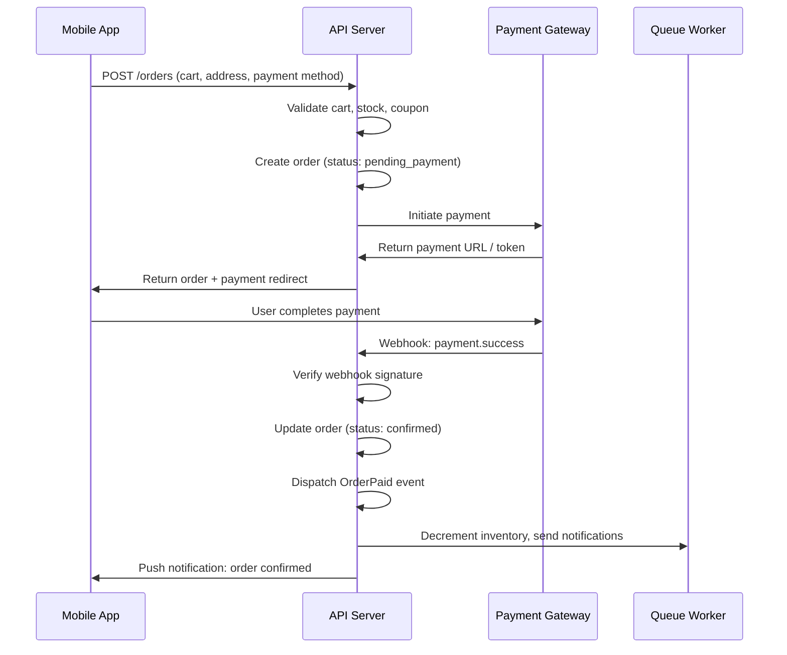

### 7.5 Live Stream Flow

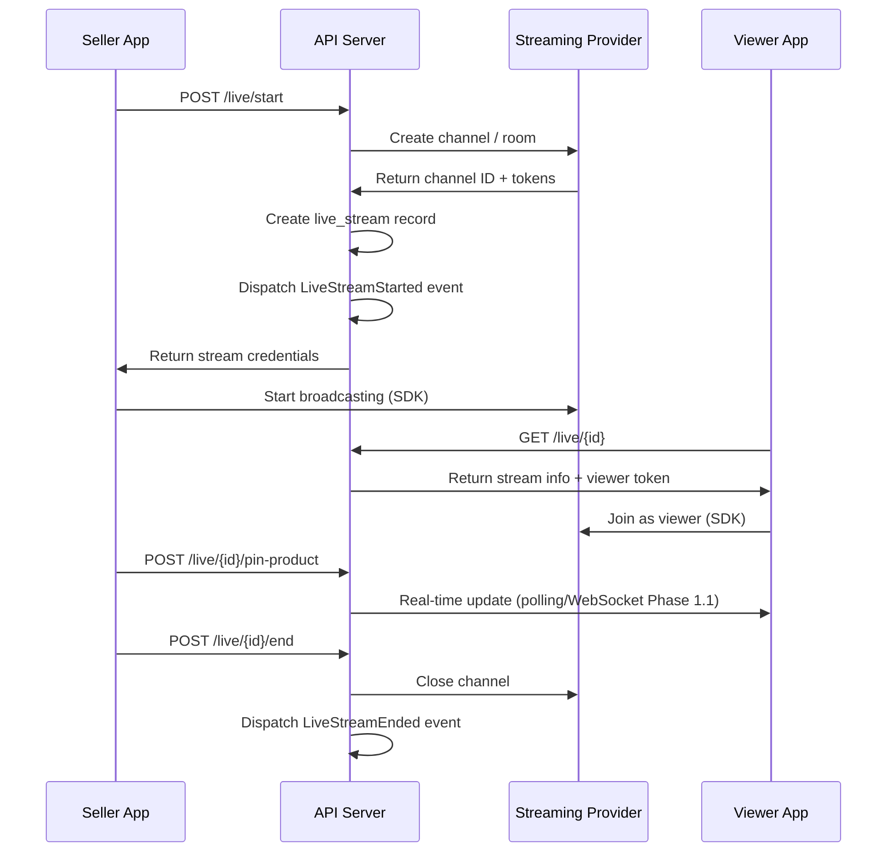

---

## 8. AI Integration

### 8.1 AI Architecture Principle

AI capabilities are integrated via an **AI Adapter** layer. Core business logic never calls AI providers directly. This allows swapping providers and enabling/disabling AI features via configuration.

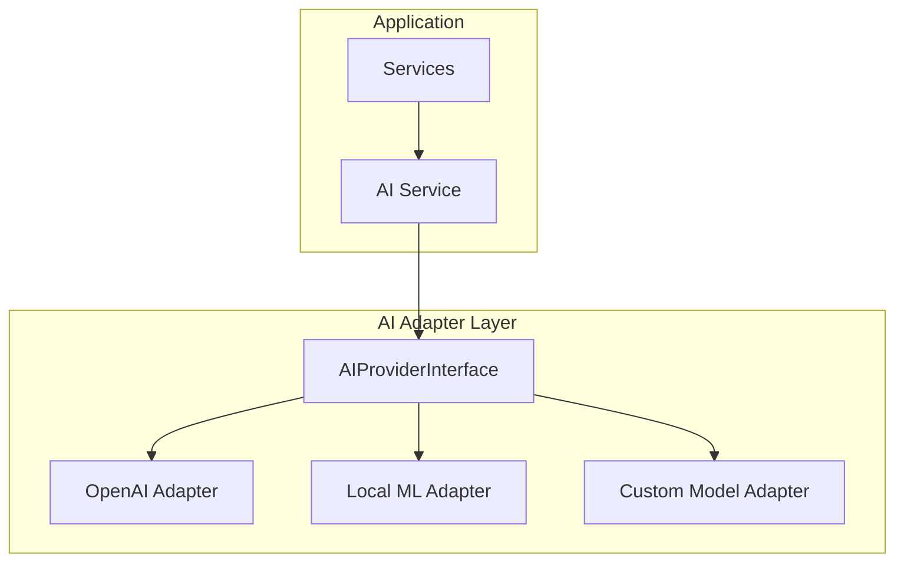

### 8.2 AI Feature Roadmap

| Feature | Phase | Trigger | Input | Output |
|---------|-------|---------|-------|--------|
| Content Moderation | Phase 2 | VideoUploaded event | Video frames / metadata | approve / flag / reject |
| Feed Ranking | Phase 2 | Feed request | User history, video features | Ranked video IDs |
| Product Description | Phase 2 | Seller creates product | Product title, images | Generated description |
| Product Title Generator | Phase 2 | Seller creates product | Image, category | Suggested titles |
| Subtitle Generation | Phase 2 | VideoProcessed event | Audio track | SRT / VTT file |
| Translation | Phase 2 | Content created | Text, target locale | Translated text |
| Thumbnail Generation | Phase 2 | VideoProcessed event | Video frames | Best thumbnail URL |
| Seller Assistant | Phase 3 | Seller dashboard chat | Store analytics, catalog | Actionable suggestions |
| Fraud Detection | Phase 3 | OrderPlaced event | Order + user signals | Risk score |

### 8.3 AI Integration Rules

1. All AI calls are **async** (queued jobs). Never block API responses.
2. AI failures must **fail gracefully** — core features work without AI.
3. AI outputs are **stored** (not re-computed on every request).
4. AI moderation results are **reviewable** by moderators before action (Phase 2).
5. User content sent to AI providers must comply with data privacy policy.
6. AI Adapter interface is defined in Architecture Phase; implementations come in Phase 2.

### 8.4 AI Service Interface (Conceptual)

```
AIProviderInterface
├── moderateContent(contentId, contentType): ModerationResult
├── generateDescription(productData): string
├── generateTitle(productData): string[]
├── rankFeed(userId, candidateIds): string[]
├── generateSubtitles(videoId): SubtitleFile
├── translate(text, targetLocale): string
└── detectFraud(orderId): FraudScore
```

---

## 9. Streaming Architecture

### 9.1 Design Goal

Live streaming provider must be **replaceable without changing business logic**. All streaming operations go through `StreamingProviderInterface`.

### 9.2 Streaming Component Diagram

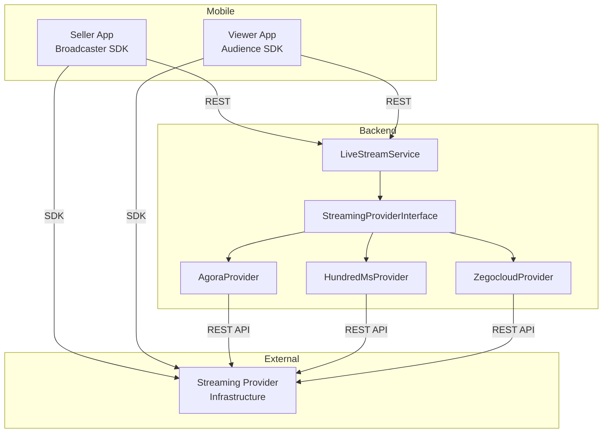

### 9.3 Streaming Provider Interface (Conceptual)

```
StreamingProviderInterface
├── createChannel(sellerId, metadata): ChannelCredentials
├── generatePublisherToken(channelId, userId): string
├── generateSubscriberToken(channelId, userId): string
├── endChannel(channelId): void
├── getViewerCount(channelId): int
└── getRecordingUrl(channelId): string | null
```

### 9.4 Provider Selection

Active provider is configured via environment variable:

```
STREAMING_PROVIDER=agora   # agora | 100ms | zegocloud
```

MVP default: **Agora** (mature SDK, Flutter support, reasonable pricing for Central Asia).

### 9.5 Live Stream Data Flow

| Step | Actor | Action |
|------|-------|--------|
| 1 | Seller | Requests to start stream via API |
| 2 | Backend | Creates channel with provider, stores `live_streams` record |
| 3 | Backend | Returns publisher token + channel ID to seller |
| 4 | Seller App | Connects to provider SDK, starts broadcast |
| 5 | Backend | Dispatches `LiveStreamStarted` → push to followers |
| 6 | Viewer | Fetches stream info via API, gets subscriber token |
| 7 | Viewer App | Connects to provider SDK, watches stream |
| 8 | Seller | Pins products via API; viewers poll or receive updates |
| 9 | Seller | Ends stream via API |
| 10 | Backend | Closes channel, updates record, dispatches `LiveStreamEnded` |

### 9.6 Live Chat

MVP: Live chat messages are sent via REST API and persisted in `live_chat_messages`. Viewers poll for new messages every 3–5 seconds.

Phase 1.1: WebSocket or provider-native messaging for real-time chat.

### 9.7 Stream Recording & Replay

Phase 1.1: Provider cloud recording enabled. On `LiveStreamEnded`, backend queues job to fetch recording URL and store in `live_streams.replay_url`.

---

## 10. Security Architecture

| Area | Approach |
|------|----------|
| Authentication | JWT (access 15 min + refresh 30 days with rotation) |
| Authorization | Laravel Policies per model/action; role-based middleware |
| Transport | TLS 1.2+ everywhere |
| Rate Limiting | Redis-backed; 60 req/min auth, 20 req/min guest |
| Input Validation | Form Requests on every write endpoint |
| File Uploads | Pre-signed URLs; MIME and size validation; no direct server upload |
| Payment | PCI delegated to gateway; no card data stored |
| Secrets | Environment variables only; never in code or repo |
| Audit | All admin/seller write actions logged to `audit_logs` |
| Encryption | Sensitive fields (phone) encrypted at rest |

---

## 11. Scalability Strategy

### 11.1 Scaling Phases

| Phase | Users | Strategy |
|-------|-------|----------|
| MVP | 0 – 50K DAU | Single region, 2 API servers, 1 DB replica |
| Growth | 50K – 500K DAU | Auto-scaling API, read replicas, Redis cluster, CDN optimization |
| Scale | 500K – 5M+ DAU | Database sharding prep, dedicated search (Elasticsearch), ML serving, multi-region CDN |

### 11.2 Bottleneck Mitigations

| Bottleneck | Mitigation |
|------------|------------|
| Feed queries | Redis cache of pre-computed feed pages; cursor pagination |
| Video delivery | CDN with adaptive bitrate HLS |
| Write-heavy tables (likes, views) | Redis counters with periodic flush to PostgreSQL |
| Live stream chat | Poll (MVP) → WebSocket (Phase 1.1) → dedicated chat service (Phase 3) |
| Search | PostgreSQL full-text (MVP) → Elasticsearch (Phase 2) |
| Video transcoding | Horizontal worker scaling; priority queues |

---

## 12. Document Revision History

| Version | Date | Author | Changes |
|---------|------|--------|---------|
| 1.0 | 2026-06-27 | Founder & CTO | Initial system architecture document |

---

**Related Documents:**
- [PRD](../docs01_PRD.md)
- [Project Context](../PROJECT_CONTEXT.md)
- [Database Design](./03_DATABASE_DESIGN.md)
- [API Specification](./04_API_SPECIFICATION.md)
- [Project Structure](./05_PROJECT_STRUCTURE.md)
- [Engineering Rules](./06_ENGINEERING_RULES.md)

**Status:** Architecture Phase — Pending Review
