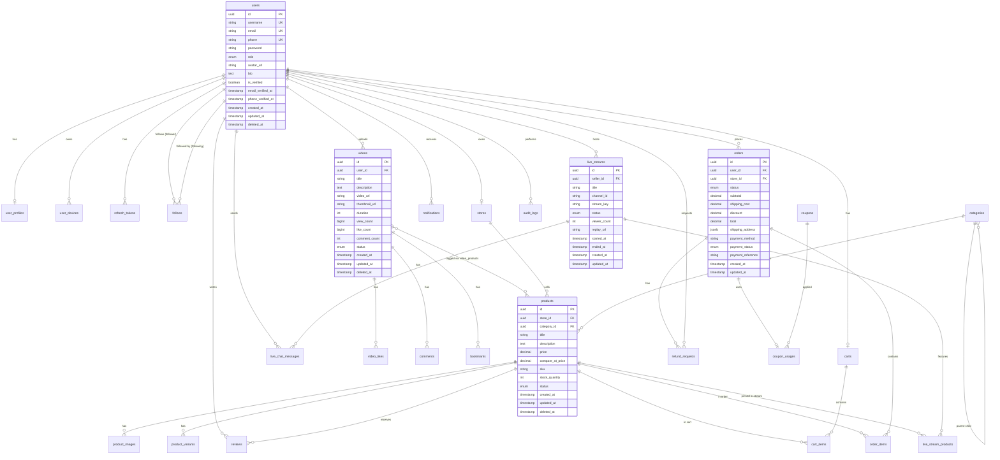

# Database Design

Version: 1.0  
Project: LiveCommerce Platform  
Status: Architecture Phase — Approved for Implementation Planning  
Document Owner: Founder & CTO  
Last Updated: 2026-06-27

---

## Document Purpose

This document defines the complete database schema for the LiveCommerce platform. It is the authoritative reference for all database design decisions, migrations, and queries.

All future migrations and data models must strictly follow this document.

---

## Table of Contents

1. [Design Principles](#1-design-principles)
2. [ER Diagram](#2-er-diagram)
3. [Entities](#3-entities)
4. [Relationships](#4-relationships)
5. [Indexes](#5-indexes)
6. [UUID Strategy](#6-uuid-strategy)
7. [Soft Deletes](#7-soft-deletes)
8. [Audit Logs](#8-audit-logs)
9. [Enumerations](#9-enumerations)
10. [Migration Conventions](#10-migration-conventions)
11. [Document Revision History](#11-document-revision-history)

---

## 1. Design Principles

| Principle | Rule |
|-----------|------|
| **Single Source of Truth** | PostgreSQL is the authoritative data store. Redis is cache only. |
| **Normalize First** | Third normal form for transactional data. Denormalize counters only where proven necessary. |
| **UUID for Public IDs** | All externally exposed entity IDs use UUID v4. |
| **Soft Delete by Default** | User-generated content and business entities use soft deletes. |
| **Audit Everything Critical** | Admin, seller, and payment actions are audit-logged. |
| **Index Foreign Keys** | Every foreign key column has an index. |
| **Timestamps Everywhere** | All tables include `created_at` and `updated_at`. |
| **No Cascading Deletes** | Use soft deletes and application-level cleanup. |
| **JSONB for Flexibility** | Settings, addresses, and metadata use JSONB with defined schemas. |
| **Future Sharding Ready** | User-scoped tables include `user_id` for potential shard key. |

---

## 2. ER Diagram

### 2.1 Core Entity Relationship Diagram



### 2.2 Module Grouping

| Domain | Tables |
|--------|--------|
| **Auth & Users** | users, user_profiles, user_devices, refresh_tokens |
| **Social** | follows, blocks |
| **Content** | videos, video_likes, comments, bookmarks, video_products |
| **Catalog** | categories, stores, products, product_images, product_variants |
| **Commerce** | carts, cart_items, orders, order_items, refund_requests, coupons, coupon_usages |
| **Live** | live_streams, live_stream_products, live_chat_messages |
| **Engagement** | notifications, reviews |
| **System** | audit_logs, media_uploads |

---

## 3. Entities

### 3.1 users

Primary account table for all platform users.

| Column | Type | Constraints | Description |
|--------|------|-------------|-------------|
| id | UUID | PK, DEFAULT gen_random_uuid() | Public user identifier |
| username | VARCHAR(30) | UNIQUE, NOT NULL | Unique handle (@username) |
| email | VARCHAR(255) | UNIQUE, NULLABLE | Email address |
| phone | VARCHAR(20) | UNIQUE, NULLABLE | Phone number (E.164 format) |
| password | VARCHAR(255) | NOT NULL | Bcrypt hashed password |
| role | VARCHAR(20) | NOT NULL, DEFAULT 'user' | user, seller, moderator, admin |
| avatar_url | VARCHAR(500) | NULLABLE | Profile avatar CDN URL |
| bio | TEXT | NULLABLE | User biography (max 500 chars enforced in app) |
| is_verified | BOOLEAN | NOT NULL, DEFAULT false | Verified badge status |
| email_verified_at | TIMESTAMP | NULLABLE | Email verification timestamp |
| phone_verified_at | TIMESTAMP | NULLABLE | Phone verification timestamp |
| locale | VARCHAR(10) | NOT NULL, DEFAULT 'uz' | Preferred language (uz, ru) |
| status | VARCHAR(20) | NOT NULL, DEFAULT 'active' | active, suspended, banned |
| created_at | TIMESTAMP | NOT NULL | Record creation |
| updated_at | TIMESTAMP | NOT NULL | Last update |
| deleted_at | TIMESTAMP | NULLABLE | Soft delete |

**Constraints:** At least one of `email` or `phone` must be present (enforced in application layer).

---

### 3.2 user_profiles

Extended profile data and denormalized counters.

| Column | Type | Constraints | Description |
|--------|------|-------------|-------------|
| id | BIGSERIAL | PK | Internal ID |
| user_id | UUID | FK → users.id, UNIQUE, NOT NULL | One profile per user |
| display_name | VARCHAR(100) | NULLABLE | Display name |
| follower_count | INTEGER | NOT NULL, DEFAULT 0 | Denormalized follower count |
| following_count | INTEGER | NOT NULL, DEFAULT 0 | Denormalized following count |
| video_count | INTEGER | NOT NULL, DEFAULT 0 | Denormalized video count |
| order_count | INTEGER | NOT NULL, DEFAULT 0 | Denormalized order count |
| notification_settings | JSONB | NOT NULL, DEFAULT '{}' | Per-type notification preferences |
| created_at | TIMESTAMP | NOT NULL | |
| updated_at | TIMESTAMP | NOT NULL | |

**notification_settings schema:**
```json
{
  "push_enabled": true,
  "email_enabled": true,
  "types": {
    "new_follower": true,
    "video_liked": true,
    "new_comment": true,
    "order_update": true,
    "live_started": true,
    "promotional": false
  }
}
```

---

### 3.3 user_devices

FCM tokens and device info for push notifications.

| Column | Type | Constraints | Description |
|--------|------|-------------|-------------|
| id | BIGSERIAL | PK | |
| user_id | UUID | FK → users.id, NOT NULL | |
| fcm_token | VARCHAR(500) | NOT NULL | Firebase device token |
| platform | VARCHAR(10) | NOT NULL | android, ios |
| device_id | VARCHAR(100) | NULLABLE | Unique device identifier |
| app_version | VARCHAR(20) | NULLABLE | App version at registration |
| is_active | BOOLEAN | NOT NULL, DEFAULT true | Token validity |
| last_used_at | TIMESTAMP | NULLABLE | Last successful push |
| created_at | TIMESTAMP | NOT NULL | |
| updated_at | TIMESTAMP | NOT NULL | |

**Unique constraint:** (user_id, fcm_token)

---

### 3.4 refresh_tokens

JWT refresh token storage for rotation and revocation.

| Column | Type | Constraints | Description |
|--------|------|-------------|-------------|
| id | BIGSERIAL | PK | |
| user_id | UUID | FK → users.id, NOT NULL | |
| token_hash | VARCHAR(64) | UNIQUE, NOT NULL | SHA-256 hash of refresh token |
| device_id | VARCHAR(100) | NULLABLE | Associated device |
| expires_at | TIMESTAMP | NOT NULL | Token expiry (30 days) |
| revoked_at | TIMESTAMP | NULLABLE | Revocation timestamp |
| created_at | TIMESTAMP | NOT NULL | |

---

### 3.5 follows

User follow relationships.

| Column | Type | Constraints | Description |
|--------|------|-------------|-------------|
| id | BIGSERIAL | PK | |
| follower_id | UUID | FK → users.id, NOT NULL | User who follows |
| following_id | UUID | FK → users.id, NOT NULL | User being followed |
| created_at | TIMESTAMP | NOT NULL | |

**Unique constraint:** (follower_id, following_id)  
**Check constraint:** follower_id != following_id

---

### 3.6 blocks

User block relationships.

| Column | Type | Constraints | Description |
|--------|------|-------------|-------------|
| id | BIGSERIAL | PK | |
| blocker_id | UUID | FK → users.id, NOT NULL | User who blocks |
| blocked_id | UUID | FK → users.id, NOT NULL | User being blocked |
| created_at | TIMESTAMP | NOT NULL | |

**Unique constraint:** (blocker_id, blocked_id)

---

### 3.7 videos

Short-form video content.

| Column | Type | Constraints | Description |
|--------|------|-------------|-------------|
| id | UUID | PK | |
| user_id | UUID | FK → users.id, NOT NULL | Uploader |
| title | VARCHAR(255) | NULLABLE | Video title |
| description | TEXT | NULLABLE | Video description |
| video_url | VARCHAR(500) | NULLABLE | CDN URL (HLS manifest) |
| thumbnail_url | VARCHAR(500) | NULLABLE | Thumbnail CDN URL |
| raw_video_url | VARCHAR(500) | NULLABLE | Original upload URL (internal) |
| duration | INTEGER | NULLABLE | Duration in seconds |
| width | INTEGER | NULLABLE | Video width in pixels |
| height | INTEGER | NULLABLE | Video height in pixels |
| view_count | BIGINT | NOT NULL, DEFAULT 0 | Total views |
| like_count | BIGINT | NOT NULL, DEFAULT 0 | Total likes |
| comment_count | INTEGER | NOT NULL, DEFAULT 0 | Total comments |
| share_count | INTEGER | NOT NULL, DEFAULT 0 | Total shares |
| status | VARCHAR(20) | NOT NULL, DEFAULT 'uploading' | uploading, processing, published, rejected, hidden, failed |
| visibility | VARCHAR(20) | NOT NULL, DEFAULT 'public' | public, followers, private |
| created_at | TIMESTAMP | NOT NULL | |
| updated_at | TIMESTAMP | NOT NULL | |
| deleted_at | TIMESTAMP | NULLABLE | Soft delete |

---

### 3.8 video_products

Many-to-many: videos tagged with products.

| Column | Type | Constraints | Description |
|--------|------|-------------|-------------|
| id | BIGSERIAL | PK | |
| video_id | UUID | FK → videos.id, NOT NULL | |
| product_id | UUID | FK → products.id, NOT NULL | |
| position_x | DECIMAL(5,2) | NULLABLE | Tag overlay X position (0-100%) |
| position_y | DECIMAL(5,2) | NULLABLE | Tag overlay Y position (0-100%) |
| created_at | TIMESTAMP | NOT NULL | |

**Unique constraint:** (video_id, product_id)

---

### 3.9 video_likes

| Column | Type | Constraints | Description |
|--------|------|-------------|-------------|
| id | BIGSERIAL | PK | |
| user_id | UUID | FK → users.id, NOT NULL | |
| video_id | UUID | FK → videos.id, NOT NULL | |
| created_at | TIMESTAMP | NOT NULL | |

**Unique constraint:** (user_id, video_id)

---

### 3.10 comments

Video comments with one-level nesting.

| Column | Type | Constraints | Description |
|--------|------|-------------|-------------|
| id | BIGSERIAL | PK | |
| user_id | UUID | FK → users.id, NOT NULL | Comment author |
| video_id | UUID | FK → videos.id, NOT NULL | |
| parent_id | BIGINT | FK → comments.id, NULLABLE | Reply to comment (1 level only) |
| body | TEXT | NOT NULL | Comment text (max 1000 chars in app) |
| like_count | INTEGER | NOT NULL, DEFAULT 0 | |
| created_at | TIMESTAMP | NOT NULL | |
| updated_at | TIMESTAMP | NOT NULL | |
| deleted_at | TIMESTAMP | NULLABLE | Soft delete |

---

### 3.11 bookmarks

Saved videos for later viewing.

| Column | Type | Constraints | Description |
|--------|------|-------------|-------------|
| id | BIGSERIAL | PK | |
| user_id | UUID | FK → users.id, NOT NULL | |
| video_id | UUID | FK → videos.id, NOT NULL | |
| created_at | TIMESTAMP | NOT NULL | |

**Unique constraint:** (user_id, video_id)

---

### 3.12 categories

Product and content categories (self-referencing tree).

| Column | Type | Constraints | Description |
|--------|------|-------------|-------------|
| id | BIGSERIAL | PK | |
| parent_id | BIGINT | FK → categories.id, NULLABLE | Parent category |
| name | VARCHAR(100) | NOT NULL | Category name |
| slug | VARCHAR(100) | UNIQUE, NOT NULL | URL-friendly slug |
| image_url | VARCHAR(500) | NULLABLE | Category image |
| sort_order | INTEGER | NOT NULL, DEFAULT 0 | Display order |
| is_active | BOOLEAN | NOT NULL, DEFAULT true | |
| created_at | TIMESTAMP | NOT NULL | |
| updated_at | TIMESTAMP | NOT NULL | |

---

### 3.13 stores

Seller store profiles.

| Column | Type | Constraints | Description |
|--------|------|-------------|-------------|
| id | UUID | PK | |
| user_id | UUID | FK → users.id, UNIQUE, NOT NULL | Store owner |
| name | VARCHAR(100) | NOT NULL | Store name |
| slug | VARCHAR(100) | UNIQUE, NOT NULL | URL-friendly slug |
| logo_url | VARCHAR(500) | NULLABLE | Store logo |
| description | TEXT | NULLABLE | Store description |
| status | VARCHAR(20) | NOT NULL, DEFAULT 'pending' | pending, active, suspended |
| commission_rate | DECIMAL(5,2) | NOT NULL, DEFAULT 10.00 | Platform commission % |
| created_at | TIMESTAMP | NOT NULL | |
| updated_at | TIMESTAMP | NOT NULL | |
| deleted_at | TIMESTAMP | NULLABLE | Soft delete |

---

### 3.14 products

| Column | Type | Constraints | Description |
|--------|------|-------------|-------------|
| id | UUID | PK | |
| store_id | UUID | FK → stores.id, NOT NULL | |
| category_id | BIGINT | FK → categories.id, NOT NULL | |
| title | VARCHAR(255) | NOT NULL | Product title |
| description | TEXT | NULLABLE | Product description |
| price | DECIMAL(12,2) | NOT NULL | Price in UZS |
| compare_at_price | DECIMAL(12,2) | NULLABLE | Original price (for discounts) |
| sku | VARCHAR(100) | NULLABLE | Stock keeping unit |
| stock_quantity | INTEGER | NOT NULL, DEFAULT 0 | Available stock |
| status | VARCHAR(20) | NOT NULL, DEFAULT 'draft' | draft, active, out_of_stock, archived |
| rating_avg | DECIMAL(3,2) | NOT NULL, DEFAULT 0 | Average rating (0-5) |
| review_count | INTEGER | NOT NULL, DEFAULT 0 | Total reviews |
| created_at | TIMESTAMP | NOT NULL | |
| updated_at | TIMESTAMP | NOT NULL | |
| deleted_at | TIMESTAMP | NULLABLE | Soft delete |

---

### 3.15 product_images

| Column | Type | Constraints | Description |
|--------|------|-------------|-------------|
| id | BIGSERIAL | PK | |
| product_id | UUID | FK → products.id, NOT NULL | |
| url | VARCHAR(500) | NOT NULL | CDN URL |
| sort_order | INTEGER | NOT NULL, DEFAULT 0 | Display order |
| created_at | TIMESTAMP | NOT NULL | |

---

### 3.16 product_variants

| Column | Type | Constraints | Description |
|--------|------|-------------|-------------|
| id | BIGSERIAL | PK | |
| product_id | UUID | FK → products.id, NOT NULL | |
| name | VARCHAR(50) | NOT NULL | Variant type (Size, Color) |
| value | VARCHAR(100) | NOT NULL | Variant value (M, Red) |
| sku | VARCHAR(100) | NULLABLE | Variant-specific SKU |
| price_adjustment | DECIMAL(12,2) | NOT NULL, DEFAULT 0 | Price delta from base |
| stock_quantity | INTEGER | NOT NULL, DEFAULT 0 | Variant stock |
| created_at | TIMESTAMP | NOT NULL | |
| updated_at | TIMESTAMP | NOT NULL | |

---

### 3.17 product_favorites

| Column | Type | Constraints | Description |
|--------|------|-------------|-------------|
| id | BIGSERIAL | PK | |
| user_id | UUID | FK → users.id, NOT NULL | |
| product_id | UUID | FK → products.id, NOT NULL | |
| created_at | TIMESTAMP | NOT NULL | |

**Unique constraint:** (user_id, product_id)

---

### 3.18 carts

| Column | Type | Constraints | Description |
|--------|------|-------------|-------------|
| id | BIGSERIAL | PK | |
| user_id | UUID | FK → users.id, UNIQUE, NOT NULL | One cart per user |
| created_at | TIMESTAMP | NOT NULL | |
| updated_at | TIMESTAMP | NOT NULL | |

---

### 3.19 cart_items

| Column | Type | Constraints | Description |
|--------|------|-------------|-------------|
| id | BIGSERIAL | PK | |
| cart_id | BIGINT | FK → carts.id, NOT NULL | |
| product_id | UUID | FK → products.id, NOT NULL | |
| variant_id | BIGINT | FK → product_variants.id, NULLABLE | |
| quantity | INTEGER | NOT NULL, DEFAULT 1 | Min 1, max 99 (app enforced) |
| created_at | TIMESTAMP | NOT NULL | |
| updated_at | TIMESTAMP | NOT NULL | |

**Unique constraint:** (cart_id, product_id, variant_id)

---

### 3.20 orders

| Column | Type | Constraints | Description |
|--------|------|-------------|-------------|
| id | UUID | PK | |
| order_number | VARCHAR(20) | UNIQUE, NOT NULL | Human-readable order number |
| user_id | UUID | FK → users.id, NOT NULL | Buyer |
| store_id | UUID | FK → stores.id, NOT NULL | Seller store |
| status | VARCHAR(20) | NOT NULL, DEFAULT 'pending_payment' | See enumerations |
| subtotal | DECIMAL(12,2) | NOT NULL | Items total before discounts |
| shipping_cost | DECIMAL(12,2) | NOT NULL, DEFAULT 0 | |
| discount | DECIMAL(12,2) | NOT NULL, DEFAULT 0 | Coupon discount |
| total | DECIMAL(12,2) | NOT NULL | Final amount |
| shipping_address | JSONB | NOT NULL | Delivery address |
| payment_method | VARCHAR(50) | NOT NULL | Gateway payment method |
| payment_status | VARCHAR(20) | NOT NULL, DEFAULT 'pending' | pending, paid, failed, refunded |
| payment_reference | VARCHAR(255) | NULLABLE | Gateway transaction ID |
| notes | TEXT | NULLABLE | Buyer notes |
| cancelled_at | TIMESTAMP | NULLABLE | |
| shipped_at | TIMESTAMP | NULLABLE | |
| delivered_at | TIMESTAMP | NULLABLE | |
| created_at | TIMESTAMP | NOT NULL | |
| updated_at | TIMESTAMP | NOT NULL | |

**shipping_address schema:**
```json
{
  "full_name": "string",
  "phone": "string",
  "region": "string",
  "city": "string",
  "address_line": "string",
  "postal_code": "string"
}
```

---

### 3.21 order_items

| Column | Type | Constraints | Description |
|--------|------|-------------|-------------|
| id | BIGSERIAL | PK | |
| order_id | UUID | FK → orders.id, NOT NULL | |
| product_id | UUID | FK → products.id, NOT NULL | |
| variant_id | BIGINT | FK → product_variants.id, NULLABLE | |
| product_title | VARCHAR(255) | NOT NULL | Snapshot at time of order |
| variant_name | VARCHAR(100) | NULLABLE | Snapshot |
| quantity | INTEGER | NOT NULL | |
| unit_price | DECIMAL(12,2) | NOT NULL | Price at time of order |
| total | DECIMAL(12,2) | NOT NULL | quantity × unit_price |
| created_at | TIMESTAMP | NOT NULL | |

---

### 3.22 refund_requests

Buyer-initiated refund requests linked to orders.

| Column | Type | Constraints | Description |
|--------|------|-------------|-------------|
| id | UUID | PK, DEFAULT gen_random_uuid() | Refund request identifier |
| order_id | UUID | FK → orders.id, NOT NULL | Related order |
| user_id | UUID | FK → users.id, NOT NULL | Requesting buyer |
| reason | TEXT | NOT NULL | Buyer-provided reason |
| status | VARCHAR(20) | NOT NULL, DEFAULT 'requested' | requested, approved, rejected, processing, completed, failed |
| created_at | TIMESTAMP | NOT NULL | |
| updated_at | TIMESTAMP | NOT NULL | |

**Indexes:** `idx_refund_requests_order`, `idx_refund_requests_user`, `idx_refund_requests_status`

---

### 3.23 coupons

| Column | Type | Constraints | Description |
|--------|------|-------------|-------------|
| id | BIGSERIAL | PK | |
| code | VARCHAR(50) | UNIQUE, NOT NULL | Coupon code |
| store_id | UUID | FK → stores.id, NULLABLE | NULL = platform-wide |
| discount_type | VARCHAR(20) | NOT NULL | percentage, fixed |
| discount_value | DECIMAL(12,2) | NOT NULL | Percentage or fixed amount |
| min_order_amount | DECIMAL(12,2) | NULLABLE | Minimum order to apply |
| usage_limit | INTEGER | NULLABLE | Max total uses (NULL = unlimited) |
| used_count | INTEGER | NOT NULL, DEFAULT 0 | Current usage count |
| starts_at | TIMESTAMP | NULLABLE | Valid from |
| expires_at | TIMESTAMP | NULLABLE | Valid until |
| is_active | BOOLEAN | NOT NULL, DEFAULT true | |
| created_at | TIMESTAMP | NOT NULL | |
| updated_at | TIMESTAMP | NOT NULL | |

---

### 3.24 coupon_usages

| Column | Type | Constraints | Description |
|--------|------|-------------|-------------|
| id | BIGSERIAL | PK | |
| coupon_id | BIGINT | FK → coupons.id, NOT NULL | |
| order_id | UUID | FK → orders.id, UNIQUE, NOT NULL | One coupon per order |
| user_id | UUID | FK → users.id, NOT NULL | |
| discount_applied | DECIMAL(12,2) | NOT NULL | Actual discount amount |
| created_at | TIMESTAMP | NOT NULL | |

---

### 3.25 live_streams

| Column | Type | Constraints | Description |
|--------|------|-------------|-------------|
| id | UUID | PK | |
| seller_id | UUID | FK → users.id, NOT NULL | Stream host |
| store_id | UUID | FK → stores.id, NOT NULL | Associated store |
| title | VARCHAR(255) | NOT NULL | Stream title |
| channel_id | VARCHAR(255) | NOT NULL | Provider channel/room ID |
| stream_key | VARCHAR(255) | NULLABLE | Provider stream key (encrypted) |
| status | VARCHAR(20) | NOT NULL, DEFAULT 'scheduled' | scheduled, live, ended, cancelled |
| viewer_count | INTEGER | NOT NULL, DEFAULT 0 | Peak or current viewers |
| replay_url | VARCHAR(500) | NULLABLE | Recording URL (Phase 1.1) |
| started_at | TIMESTAMP | NULLABLE | Actual start time |
| ended_at | TIMESTAMP | NULLABLE | Actual end time |
| created_at | TIMESTAMP | NOT NULL | |
| updated_at | TIMESTAMP | NOT NULL | |

---

### 3.26 live_stream_products

| Column | Type | Constraints | Description |
|--------|------|-------------|-------------|
| id | BIGSERIAL | PK | |
| live_stream_id | UUID | FK → live_streams.id, NOT NULL | |
| product_id | UUID | FK → products.id, NOT NULL | |
| is_pinned | BOOLEAN | NOT NULL, DEFAULT false | Currently pinned |
| pinned_at | TIMESTAMP | NULLABLE | When pinned |
| sort_order | INTEGER | NOT NULL, DEFAULT 0 | |
| created_at | TIMESTAMP | NOT NULL | |

---

### 3.27 live_chat_messages

| Column | Type | Constraints | Description |
|--------|------|-------------|-------------|
| id | BIGSERIAL | PK | |
| live_stream_id | UUID | FK → live_streams.id, NOT NULL | |
| user_id | UUID | FK → users.id, NOT NULL | Message sender |
| message | VARCHAR(500) | NOT NULL | Chat message text |
| created_at | TIMESTAMP | NOT NULL | |

---

### 3.28 notifications

| Column | Type | Constraints | Description |
|--------|------|-------------|-------------|
| id | BIGSERIAL | PK | |
| user_id | UUID | FK → users.id, NOT NULL | Recipient |
| type | VARCHAR(50) | NOT NULL | Notification type |
| title | VARCHAR(255) | NOT NULL | Notification title |
| body | TEXT | NOT NULL | Notification body |
| data | JSONB | NOT NULL, DEFAULT '{}' | Deep link data |
| read_at | TIMESTAMP | NULLABLE | NULL = unread |
| created_at | TIMESTAMP | NOT NULL | |

**data schema example:**
```json
{
  "entity_type": "video",
  "entity_id": "uuid",
  "actor_id": "uuid",
  "route": "/videos/{id}"
}
```

---

### 3.29 reviews

| Column | Type | Constraints | Description |
|--------|------|-------------|-------------|
| id | BIGSERIAL | PK | |
| user_id | UUID | FK → users.id, NOT NULL | Reviewer |
| product_id | UUID | FK → products.id, NOT NULL | |
| order_id | UUID | FK → orders.id, NOT NULL | Verified purchase |
| rating | SMALLINT | NOT NULL, CHECK (1-5) | Star rating |
| comment | TEXT | NULLABLE | Review text |
| created_at | TIMESTAMP | NOT NULL | |
| updated_at | TIMESTAMP | NOT NULL | |
| deleted_at | TIMESTAMP | NULLABLE | Soft delete |

**Unique constraint:** (user_id, product_id, order_id)

---

### 3.30 media_uploads

Tracks all file uploads for processing pipeline.

| Column | Type | Constraints | Description |
|--------|------|-------------|-------------|
| id | UUID | PK | |
| user_id | UUID | FK → users.id, NOT NULL | Uploader |
| entity_type | VARCHAR(50) | NULLABLE | video, product_image, avatar |
| entity_id | UUID | NULLABLE | Associated entity ID |
| file_name | VARCHAR(255) | NOT NULL | Original file name |
| mime_type | VARCHAR(100) | NOT NULL | MIME type |
| file_size | BIGINT | NOT NULL | Size in bytes |
| storage_path | VARCHAR(500) | NOT NULL | S3 object key |
| status | VARCHAR(20) | NOT NULL, DEFAULT 'pending' | pending, uploaded, processing, completed, failed |
| created_at | TIMESTAMP | NOT NULL | |
| updated_at | TIMESTAMP | NOT NULL | |

---

### 3.31 audit_logs

See [Section 8: Audit Logs](#8-audit-logs).

---

## 4. Relationships

### 4.1 Relationship Summary

| Parent | Child | Type | FK Column | On Delete |
|--------|-------|------|-----------|-----------|
| users | user_profiles | 1:1 | user_id | RESTRICT |
| users | user_devices | 1:N | user_id | RESTRICT |
| users | refresh_tokens | 1:N | user_id | RESTRICT |
| users | follows (follower) | 1:N | follower_id | RESTRICT |
| users | follows (following) | 1:N | following_id | RESTRICT |
| users | videos | 1:N | user_id | RESTRICT |
| users | stores | 1:1 | user_id | RESTRICT |
| users | orders | 1:N | user_id | RESTRICT |
| users | carts | 1:1 | user_id | RESTRICT |
| users | notifications | 1:N | user_id | RESTRICT |
| users | reviews | 1:N | user_id | RESTRICT |
| users | live_streams | 1:N | seller_id | RESTRICT |
| videos | video_likes | 1:N | video_id | RESTRICT |
| videos | comments | 1:N | video_id | RESTRICT |
| videos | bookmarks | 1:N | video_id | RESTRICT |
| videos ↔ products | video_products | M:N | video_id, product_id | RESTRICT |
| stores | products | 1:N | store_id | RESTRICT |
| categories | products | 1:N | category_id | RESTRICT |
| categories | categories | 1:N (self) | parent_id | RESTRICT |
| products | product_images | 1:N | product_id | RESTRICT |
| products | product_variants | 1:N | product_id | RESTRICT |
| products | reviews | 1:N | product_id | RESTRICT |
| carts | cart_items | 1:N | cart_id | RESTRICT |
| orders | order_items | 1:N | order_id | RESTRICT |
| orders | refund_requests | 1:N | order_id | RESTRICT |
| users | refund_requests | 1:N | user_id | RESTRICT |
| live_streams | live_stream_products | 1:N | live_stream_id | RESTRICT |
| live_streams | live_chat_messages | 1:N | live_stream_id | RESTRICT |
| coupons | coupon_usages | 1:N | coupon_id | RESTRICT |

**Policy:** No CASCADE deletes. All deletions are soft deletes at the application level. Foreign keys use RESTRICT to prevent accidental hard deletes.

---

## 5. Indexes

### 5.1 Primary & Unique Indexes

All primary keys and unique constraints create indexes automatically.

### 5.2 Foreign Key Indexes

Every foreign key column listed in Section 4 must have a dedicated index.

### 5.3 Query-Optimized Indexes

| Table | Index | Columns | Purpose |
|-------|-------|---------|---------|
| users | idx_users_role | (role) | Filter by role |
| users | idx_users_status | (status) | Filter active/suspended |
| users | idx_users_created_at | (created_at) | Registration analytics |
| videos | idx_videos_feed | (status, created_at DESC) | Feed queries |
| videos | idx_videos_user | (user_id, status, created_at DESC) | User profile videos |
| videos | idx_videos_trending | (status, view_count DESC, created_at DESC) | Trending feed |
| video_likes | idx_video_likes_video | (video_id) | Like count queries |
| comments | idx_comments_video | (video_id, created_at DESC) | Video comments |
| comments | idx_comments_parent | (parent_id) | Reply threads |
| follows | idx_follows_follower | (follower_id) | Who I follow |
| follows | idx_follows_following | (following_id) | My followers |
| products | idx_products_catalog | (category_id, status, created_at DESC) | Category browsing |
| products | idx_products_store | (store_id, status) | Store products |
| products | idx_products_search | USING GIN (to_tsvector('simple', title \|\| ' ' \|\| coalesce(description, ''))) | Full-text search |
| orders | idx_orders_user | (user_id, status, created_at DESC) | User order history |
| orders | idx_orders_store | (store_id, status, created_at DESC) | Seller order management |
| orders | idx_orders_payment | (payment_status, created_at) | Payment reconciliation |
| refund_requests | idx_refund_requests_order | (order_id) | Order refund lookup |
| refund_requests | idx_refund_requests_user | (user_id, created_at DESC) | User refund history |
| refund_requests | idx_refund_requests_status | (status, created_at DESC) | Admin refund queue |
| notifications | idx_notifications_user | (user_id, read_at, created_at DESC) | Notification feed |
| live_streams | idx_live_streams_status | (status, started_at DESC) | Active streams |
| live_streams | idx_live_streams_seller | (seller_id, created_at DESC) | Seller stream history |
| live_chat_messages | idx_live_chat_stream | (live_stream_id, created_at DESC) | Chat history |
| refresh_tokens | idx_refresh_tokens_user | (user_id, expires_at) | Token cleanup |
| audit_logs | idx_audit_logs_entity | (entity_type, entity_id) | Entity audit trail |
| audit_logs | idx_audit_logs_user | (user_id, created_at DESC) | User action history |
| audit_logs | idx_audit_logs_created | (created_at DESC) | Time-based queries |
| media_uploads | idx_media_uploads_status | (status, created_at) | Processing queue |

### 5.4 Partial Indexes

| Table | Index | Condition | Purpose |
|-------|-------|-----------|---------|
| videos | idx_videos_published | (created_at DESC) WHERE status = 'published' AND deleted_at IS NULL | Feed performance |
| products | idx_products_active | (created_at DESC) WHERE status = 'active' AND deleted_at IS NULL | Catalog queries |
| notifications | idx_notifications_unread | (user_id, created_at DESC) WHERE read_at IS NULL | Unread count |
| live_streams | idx_live_streams_live | (started_at DESC) WHERE status = 'live' | Active live streams |

---

## 6. UUID Strategy

### 6.1 When to Use UUID

| Use UUID | Use BIGSERIAL |
|----------|---------------|
| users.id | user_profiles.id |
| videos.id | video_likes.id |
| products.id | comments.id |
| stores.id | follows.id |
| orders.id | cart_items.id |
| live_streams.id | notifications.id |
| media_uploads.id | All pivot/junction tables |
| | categories.id |
| | coupons.id |

### 6.2 UUID Generation

- **Database-side:** `gen_random_uuid()` (PostgreSQL pgcrypto extension).
- **Application-side:** UUID v4 generated before insert when pre-assigning IDs (e.g., media upload flow where S3 path includes the ID).
- **Never sequential integers** for externally exposed entity IDs.

### 6.3 UUID in API Responses

All public-facing entity IDs in API responses are UUID strings:

```json
{
  "id": "a1b2c3d4-e5f6-7890-abcd-ef1234567890"
}
```

Internal BIGSERIAL IDs are never exposed in API responses.

### 6.4 UUID Storage

- PostgreSQL native `UUID` type (16 bytes).
- Indexed normally; no performance concern at MVP scale.
- At sharding phase, UUID v7 (time-sortable) may be adopted for new tables.

---

## 7. Soft Deletes

### 7.1 Soft Delete Policy

| Category | Soft Delete | Hard Delete |
|----------|-------------|-------------|
| User accounts | Yes | Never (GDPR anonymization instead) |
| Videos | Yes | Admin purge after 90 days |
| Comments | Yes | Never |
| Products | Yes | Never |
| Stores | Yes | Never |
| Reviews | Yes | Never |
| Orders | No | Never (financial records) |
| Carts / Cart Items | No | Cascade delete on cart clear |
| Notifications | No | Hard delete after 90 days (scheduled job) |
| Live chat messages | No | Retained for moderation |
| Audit logs | No | Never deleted |
| Refresh tokens | No | Hard delete on expiry/revocation |

### 7.2 Implementation

- Soft-deleted tables include `deleted_at TIMESTAMP NULLABLE`.
- Default Eloquent scope: `whereNull('deleted_at')`.
- Admin queries can use `withTrashed()` or `onlyTrashed()`.
- Unique constraints on soft-deleted tables use partial unique indexes where needed (e.g., username remains unique among non-deleted users).

### 7.3 Account Deletion (GDPR)

When a user requests account deletion:

1. Set `users.deleted_at` (soft delete).
2. Anonymize PII: email → `deleted_{uuid}@deleted.local`, phone → NULL, avatar → NULL, bio → NULL.
3. Revoke all refresh tokens.
4. Videos set to status `hidden`.
5. Comments remain but display as "[deleted user]".
6. Orders retained for financial/legal compliance.

---

## 8. Audit Logs

### 8.1 Purpose

Track all significant actions performed by sellers, moderators, and administrators for compliance, debugging, and security.

### 8.2 audit_logs Table

| Column | Type | Constraints | Description |
|--------|------|-------------|-------------|
| id | BIGSERIAL | PK | |
| user_id | UUID | FK → users.id, NULLABLE | Actor (NULL for system actions) |
| action | VARCHAR(100) | NOT NULL | Action identifier |
| entity_type | VARCHAR(50) | NOT NULL | Target entity type |
| entity_id | VARCHAR(36) | NOT NULL | Target entity ID (UUID or bigint as string) |
| old_values | JSONB | NULLABLE | Previous state (changed fields only) |
| new_values | JSONB | NULLABLE | New state (changed fields only) |
| ip_address | INET | NULLABLE | Actor IP address |
| user_agent | VARCHAR(500) | NULLABLE | Actor user agent |
| created_at | TIMESTAMP | NOT NULL | |

### 8.3 Audited Actions

| Action | Entity | Actor Roles |
|--------|--------|-------------|
| user.login | user | all |
| user.register | user | all |
| user.suspend | user | admin, moderator |
| user.ban | user | admin |
| user.role_change | user | admin |
| store.approve | store | admin |
| store.suspend | store | admin, moderator |
| product.create | product | seller |
| product.update | product | seller |
| product.delete | product | seller |
| product.status_change | product | seller, admin |
| order.status_change | order | seller, admin |
| order.refund | order | admin |
| video.delete | video | user, moderator, admin |
| video.status_change | video | moderator, admin |
| coupon.create | coupon | seller, admin |
| settings.update | platform | admin |
| category.create | category | admin |
| category.update | category | admin |

### 8.4 Audit Log Rules

1. Audit logs are **append-only**. Never updated or deleted.
2. Audit logging is performed in the **service layer**, not controllers.
3. Sensitive fields (password, tokens) are **never** stored in old_values/new_values.
4. System-initiated actions (webhooks, scheduled jobs) log with `user_id = NULL`.
5. Audit logs are queryable by admin panel only.
6. Retention: indefinite for MVP; archive to cold storage after 2 years (Phase 2).

---

## 9. Enumerations

### 9.1 users.role

| Value | Description |
|-------|-------------|
| user | Standard buyer account |
| seller | Approved seller with store |
| moderator | Content moderator |
| admin | Platform administrator |

### 9.2 users.status

| Value | Description |
|-------|-------------|
| active | Normal account |
| suspended | Temporarily restricted |
| banned | Permanently restricted |

### 9.3 videos.status

| Value | Description |
|-------|-------------|
| uploading | File upload in progress |
| processing | Transcoding in progress |
| published | Live and visible |
| rejected | Failed moderation |
| hidden | Hidden by owner or moderator |
| failed | Upload or processing failed |

### 9.4 products.status

| Value | Description |
|-------|-------------|
| draft | Not visible to buyers |
| active | Available for purchase |
| out_of_stock | Visible but not purchasable |
| archived | Removed from catalog |

### 9.5 orders.status

| Value | Description |
|-------|-------------|
| pending_payment | Awaiting payment |
| confirmed | Payment received |
| processing | Seller preparing |
| shipped | In transit |
| delivered | Completed |
| cancelled | Cancelled by buyer or seller |
| refunded | Refund processed |

### 9.6 orders.payment_status

| Value | Description |
|-------|-------------|
| pending | Awaiting payment |
| paid | Payment confirmed |
| failed | Payment failed |
| refunded | Refund issued |

### 9.7 live_streams.status

| Value | Description |
|-------|-------------|
| scheduled | Created but not started |
| live | Currently broadcasting |
| ended | Stream finished |
| cancelled | Cancelled before start |

### 9.8 stores.status

| Value | Description |
|-------|-------------|
| pending | Awaiting approval |
| active | Approved and operational |
| suspended | Temporarily disabled |

### 9.9 refund_requests.status

| Value | Description |
|-------|-------------|
| requested | Buyer submitted refund request |
| approved | Admin approved request |
| rejected | Admin rejected request |
| processing | Gateway refund in progress |
| completed | Refund confirmed by gateway |
| failed | Gateway refund failed |

---

## 10. Migration Conventions

### 10.1 Naming

```
YYYY_MM_DD_HHMMSS_create_{table_name}_table.php
YYYY_MM_DD_HHMMSS_add_{column}_to_{table_name}_table.php
```

### 10.2 Rules

1. One migration per table creation.
2. Column additions in separate migrations.
3. Never modify a migration after it has been merged to develop.
4. Include both `up()` and `down()` methods.
5. Seed data goes in seeders, not migrations.
6. Index creation in the same migration as the table (or immediately after).

### 10.3 Migration Order

1. users
2. user_profiles, user_devices, refresh_tokens
3. follows, blocks
4. categories
5. stores
6. products, product_images, product_variants, product_favorites
7. videos, video_products, video_likes, comments, bookmarks
8. carts, cart_items
9. coupons, coupon_usages
10. orders, order_items, refund_requests
11. live_streams, live_stream_products, live_chat_messages
12. notifications, reviews
13. media_uploads
14. audit_logs

---

## 11. Document Revision History

| Version | Date | Author | Changes |
|---------|------|--------|---------|
| 1.0 | 2026-06-27 | Founder & CTO | Initial database design document |
| 1.1 | 2026-06-27 | Architecture Review | P0 patches: `failed` video status, `refund_requests` table |

---

**Related Documents:**
- [System Architecture](./02_SYSTEM_ARCHITECTURE.md)
- [API Specification](./04_API_SPECIFICATION.md)
- [Project Structure](./05_PROJECT_STRUCTURE.md)

**Status:** Architecture Phase — Pending Review
