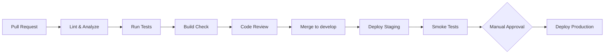

# Engineering Rules

Version: 1.0  
Project: LiveCommerce Platform  
Status: Architecture Phase — Approved for Implementation Planning  
Document Owner: Founder & CTO  
Last Updated: 2026-06-27

---

## Document Purpose

This document defines the engineering standards, workflows, and quality gates for the LiveCommerce platform. Every developer and AI agent working on this project must follow these rules.

These rules are enforced through code review, CI/CD pipelines, and architectural conventions defined in companion documents.

---

## Table of Contents

1. [Core Principles](#1-core-principles)
2. [Coding Standards — Backend](#2-coding-standards--backend)
3. [Coding Standards — Mobile](#3-coding-standards--mobile)
4. [Architecture Rules](#4-architecture-rules)
5. [Git Workflow](#5-git-workflow)
6. [Pull Request Process](#6-pull-request-process)
7. [Testing Strategy](#7-testing-strategy)
8. [CI/CD Preparation](#8-cicd-preparation)
9. [Security Rules](#9-security-rules)
10. [Performance Rules](#10-performance-rules)
11. [Documentation Rules](#11-documentation-rules)
12. [Sprint Release Audit](#12-sprint-release-audit)
13. [Document Revision History](#13-document-revision-history)

---

## 1. Core Principles

1. **Long-term maintainability over short-term speed.** Never ship hacks that will be expensive to fix later.
2. **Follow the architecture documents.** System Architecture, Database Design, API Specification, and Project Structure are the source of truth.
3. **Business logic belongs in services (backend) and use cases (mobile).** Never in controllers or widgets.
4. **Test what matters.** Focus on business logic, API contracts, and critical user flows.
5. **One responsibility per class/function.** If it does two things, split it.
6. **No duplicated logic.** Extract shared code into services, utilities, or shared widgets.
7. **Fail gracefully.** External service failures must not crash the application.
8. **Security is not optional.** Validate input, authorize actions, encrypt sensitive data.

---

## 2. Coding Standards — Backend

### 2.1 PHP Standards

| Standard | Rule |
|----------|------|
| PHP Version | 8.4+ |
| Coding Style | PSR-12 |
| Auto-formatter | Laravel Pint |
| Static Analysis | PHPStan Level 6+ |
| Type Declarations | Strict types on all files; typed properties, parameters, and return types |
| Strict Types | `declare(strict_types=1);` at top of every PHP file |

### 2.2 Laravel Conventions

**Controllers:**
```php
// Correct: thin controller
public function store(CreateVideoRequest $request): JsonResponse
{
    $video = $this->videoService->create($request->validated(), $request->user());

    return response()->json([
        'success' => true,
        'data' => new VideoResource($video),
    ], 201);
}

// Wrong: business logic in controller
public function store(Request $request): JsonResponse
{
    $video = Video::create($request->all());
    ProcessVideoJob::dispatch($video);
    // ... more logic
}
```

**Services:**
- One service per domain module.
- Public methods represent business operations.
- Services dispatch events; they do not send notifications directly.
- Services throw domain exceptions; they do not return HTTP responses.

**Repositories:**
- All database queries live in repositories.
- Repositories return Models or Collections, never arrays.
- Complex queries use query scopes on Models.

**Form Requests:**
- All validation rules in Form Request classes.
- Authorization logic in `authorize()` method.
- Custom error messages in `messages()` method.

**API Resources:**
- All API responses use Resource classes.
- Never return Eloquent models directly.
- Compact variants for nested/embedded resources.

### 2.3 Naming Rules

| Element | Rule | Example |
|---------|------|---------|
| Service methods | Verb + noun | `createVideo()`, `processPayment()` |
| Repository methods | Query intent | `findPublishedByUserId()`, `getActiveProducts()` |
| Events | Past tense | `VideoUploaded`, `OrderPlaced` |
| Jobs | Action + Job suffix | `ProcessVideoJob`, `SendPushNotificationJob` |
| Exceptions | Descriptive + Exception | `InsufficientStockException` |
| Config keys | Module.feature | `streaming.provider`, `payment.gateway` |

### 2.4 Forbidden Patterns

- No business logic in controllers, middleware, or routes.
- No raw SQL queries (use Eloquent or Query Builder).
- No `DB::` facade in services (use repositories).
- No hardcoded strings for statuses (use enums or constants).
- No `env()` calls outside config files.
- No `dd()`, `dump()`, or `var_dump()` in committed code.
- No commented-out code in commits.
- No secrets in code, comments, or commit messages.

---

## 3. Coding Standards — Mobile

### 3.1 Dart Standards

| Standard | Rule |
|----------|------|
| Dart Version | 3.x |
| Linting | `flutter_lints` + custom rules in `analysis_options.yaml` |
| Formatting | `dart format` (120 char line length) |
| State Management | Riverpod (Notifier pattern) |
| Navigation | GoRouter |
| HTTP Client | Dio |

### 3.2 Clean Architecture Rules

**Domain layer:**
- Pure Dart only. No `import 'package:flutter/...'`.
- Entities are immutable classes with `copyWith`.
- Use cases have a single `call()` method.
- Repository interfaces define contracts.

**Data layer:**
- Models extend or map to entities.
- Remote data sources call API client directly.
- Local data sources handle cache/offline storage.
- Repository implementations coordinate remote + local.

**Presentation layer:**
- Screens are `ConsumerWidget` or `ConsumerStatefulWidget`.
- State classes are immutable (use `freezed` or manual `copyWith`).
- Providers expose state and actions.
- Widgets are small and focused (< 200 lines).

### 3.3 Widget Rules

- Extract widgets when build method exceeds ~80 lines.
- Use `const` constructors wherever possible.
- No business logic in widgets; delegate to providers.
- All user-facing strings through localization (`AppLocalizations`).
- All colors and text styles from theme, never hardcoded.

### 3.4 Forbidden Patterns

- No API calls from widgets or screens (use data sources via repositories).
- No direct `SharedPreferences` usage (use storage abstraction).
- No `setState` for app-wide state (use Riverpod).
- No cross-feature imports (see Project Structure doc).
- No hardcoded API URLs (use constants/env).
- No `print()` in committed code (use logging abstraction).

---

## 4. Architecture Rules

### 4.1 Layer Dependency Rules

**Backend:**
```
Controllers → Services → Repositories → Models
Controllers → Form Requests
Controllers → Resources
Controllers → Policies
Services → Events → Listeners → Jobs
Services → External Adapters (via interfaces)
```

**Mobile:**
```
Presentation → Domain ← Data
Presentation → Shared Widgets
Data → Core (network, storage)
Domain → (nothing external)
```

### 4.2 Adding a New Feature Checklist

Before writing code for any feature:

1. Read the relevant PRD section.
2. Read the System Architecture document.
3. Confirm database tables exist in Database Design (create migration if not).
4. Confirm API endpoints exist in API Specification (add if not).
5. Confirm folder structure in Project Structure.
6. Create backend: migration → model → repository → service → controller → resource → tests.
7. Create mobile: entity → repository interface → data source → repository impl → use case → provider → screen → tests.
8. Open PR following Git Workflow.

### 4.3 Database Change Rules

1. All schema changes require a migration.
2. Migrations must have `up()` and `down()` methods.
3. Never modify a migration that has been merged to `develop`.
4. New columns must be nullable or have defaults (for zero-downtime deploys).
5. Index additions can be in the same migration as the table or a separate one.
6. Update Database Design document when schema changes.

### 4.4 API Change Rules

1. All endpoint changes must be reflected in API Specification first.
2. New fields in responses must be additive (non-breaking).
3. Breaking changes require a new API version (`/api/v2/`).
4. All endpoints must have corresponding Feature tests before merge.

---

## 5. Git Workflow

### 5.1 Branch Strategy

```
main          ← Production releases only
develop       ← Integration branch (default)
feature/*     ← New features
fix/*         ← Bug fixes
hotfix/*      ← Production emergency fixes
release/*     ← Release preparation
```

### 5.2 Branch Naming

```
feature/video-upload
feature/seller-dashboard
fix/cart-quantity-validation
hotfix/payment-webhook-signature
release/v1.0.0
```

### 5.3 Commit Messages

Follow [Conventional Commits](https://www.conventionalcommits.org/):

```
<type>(<scope>): <description>

[optional body]

[optional footer]
```

**Types:**

| Type | Usage |
|------|-------|
| feat | New feature |
| fix | Bug fix |
| refactor | Code change that neither fixes a bug nor adds a feature |
| test | Adding or updating tests |
| docs | Documentation only |
| chore | Build, CI, dependencies |
| perf | Performance improvement |

**Examples:**
```
feat(auth): add phone OTP verification
fix(cart): prevent negative quantity values
refactor(video): extract transcoding logic to service
test(order): add checkout flow feature tests
docs(api): add live streaming endpoints
chore(deps): update Laravel to 12.1
```

### 5.4 Branch Rules

1. `main` is protected. No direct commits.
2. `develop` is protected. Merge via PR only.
3. Feature branches are created from `develop`.
4. Hotfix branches are created from `main` and merged to both `main` and `develop`.
5. Delete feature branches after merge.
6. Rebase feature branches on `develop` before opening PR (if behind).

### 5.5 Release Process

1. Create `release/v1.x.0` from `develop`.
2. Final testing and bug fixes on release branch.
3. Merge to `main` with tag `v1.x.0`.
4. Merge back to `develop`.
5. Deploy tagged release to production.

---

## 6. Pull Request Process

### 6.1 PR Requirements

Every PR must:

- [ ] Have a descriptive title following Conventional Commits.
- [ ] Reference the related feature/requirement.
- [ ] Include tests for new functionality.
- [ ] Pass all CI checks.
- [ ] Have at least one approval from a team member.
- [ ] Not exceed ~500 lines of changes (split large features).

### 6.2 PR Template

```markdown
## Summary
Brief description of what this PR does.

## Changes
- Change 1
- Change 2

## Test Plan
- [ ] Test case 1
- [ ] Test case 2

## Architecture Compliance
- [ ] Follows System Architecture
- [ ] Database changes match Database Design
- [ ] API changes match API Specification
- [ ] File structure matches Project Structure
```

### 6.3 Code Review Checklist

**Backend:**
- [ ] Business logic in services, not controllers
- [ ] Validation in Form Requests
- [ ] Authorization in Policies
- [ ] API responses use Resources
- [ ] Database queries in Repositories
- [ ] Heavy tasks queued as Jobs
- [ ] Events used for side effects
- [ ] No secrets in code
- [ ] Tests cover happy path and main error cases

**Mobile:**
- [ ] Follows Clean Architecture layers
- [ ] No cross-feature imports
- [ ] State managed via Riverpod
- [ ] Strings localized
- [ ] Theme used for colors/styles
- [ ] No hardcoded URLs or keys
- [ ] Widgets are reasonably sized
- [ ] Tests for use cases and providers

---

## 7. Testing Strategy

### 7.1 Testing Pyramid

```
        ╱  E2E / Integration  ╲        ← Few, critical flows
       ╱    Feature / Widget    ╲      ← Moderate, API + UI
      ╱      Unit Tests            ╲    ← Many, business logic
```

### 7.2 Backend Testing

| Type | Scope | Location | Target Coverage |
|------|-------|----------|-----------------|
| Unit | Services, repositories | `tests/Unit/` | 80%+ |
| Feature | HTTP endpoints | `tests/Feature/` | All endpoints |
| Integration | External services (mocked) | `tests/Feature/` | Critical paths |

**Feature test example scope:**
- Auth: register, login, refresh, logout, OTP
- Video: create, upload confirm, like, comment, feed
- Cart: add, update, remove, clear
- Order: checkout, status transitions, cancel
- Seller: apply, product CRUD, order management
- Live: start, end, chat, pin product

**Testing tools:**
- Pest 3.x with pest-plugin-laravel (ADR-013)
- Laravel HTTP test helpers
- Model factories for test data
- Mock external services (streaming, payment, SMS, FCM)

**Run commands:**
```bash
php artisan test                    # All tests
php artisan test --filter=AuthTest  # Specific test
./vendor/bin/pint --test            # Code style check
./vendor/bin/phpstan analyse        # Static analysis
```

### 7.3 Mobile Testing

| Type | Scope | Location | Target Coverage |
|------|-------|----------|-----------------|
| Unit | Use cases, repositories, utils | `test/` | 70%+ |
| Widget | Individual widgets | `test/` | Key components |
| Integration | Full user flows | `integration_test/` | Critical flows |

**Integration test flows (MVP):**
1. Register → Login → Browse feed
2. View product → Add to cart → Checkout
3. Upload video → Confirm → View in feed
4. Seller: Create product → View in store

**Testing tools:**
- `flutter test` (unit + widget)
- `integration_test` package
- `mockito` or `mocktail` for mocking
- `flutter analyze` for static analysis

**Run commands:**
```bash
flutter analyze                     # Static analysis
flutter test                        # All tests
flutter test test/features/auth/    # Specific feature tests
```

### 7.4 Test Data

- Backend: use Model factories, never seed production data in tests.
- Mobile: use mock repositories for unit tests; use test API server for integration tests.
- No test should depend on another test's state.
- Tests must run in isolation and in any order.

### 7.5 When Tests Are Required

| Change Type | Required Tests |
|-------------|----------------|
| New API endpoint | Feature test (happy + error paths) |
| New service method | Unit test |
| Bug fix | Regression test proving the fix |
| New mobile screen | Widget test (at minimum) |
| New use case | Unit test |
| Refactoring | Existing tests must still pass |

---

## 8. CI/CD Preparation

### 8.1 Pipeline Overview



### 8.2 Backend CI (`backend-ci.yml`)

**Trigger:** Pull request to `develop` or `main` (paths: `backend/**`)

**Steps:**
1. Setup PHP 8.4 with required extensions
2. `composer install --no-interaction`
3. Copy `.env.example` to `.env`, generate app key
4. `./vendor/bin/pint --test` (code style)
5. `./vendor/bin/phpstan analyse` (static analysis)
6. `php artisan test --parallel` (run tests)
7. Report coverage (target: 80% services/repositories)

### 8.3 Mobile CI (`mobile-ci.yml`)

**Trigger:** Pull request to `develop` or `main` (paths: `mobile/**`)

**Steps:**
1. Setup Flutter SDK (stable channel)
2. `flutter pub get`
3. `flutter analyze` (static analysis)
4. `flutter test` (unit + widget tests)
5. `flutter build apk --debug` (compile check)

### 8.4 Deploy Staging (`deploy-staging.yml`)

**Trigger:** Push to `develop`

**Steps:**
1. Run backend CI + mobile CI
2. Build Docker image for backend
3. Push image to container registry
4. Deploy to staging environment
5. Run database migrations
6. Run smoke tests against staging API
7. Notify team (Slack/email)

### 8.5 Production Deploy

**Trigger:** Tag push (`v*.*.*`) or manual workflow dispatch

**Steps:**
1. All CI checks pass
2. Manual approval gate
3. Deploy to production (blue-green or rolling)
4. Run database migrations
5. Health check verification
6. Rollback procedure documented and tested

### 8.6 Environment Variables in CI

- Secrets stored in GitHub Actions secrets (never in workflow files).
- Staging and production have separate secret sets.
- CI uses `.env.example` with test values for running tests.

### 8.7 Pre-Implementation CI Setup

Before writing production code, prepare:

- [ ] `.github/workflows/backend-ci.yml`
- [ ] `.github/workflows/mobile-ci.yml`
- [ ] `.github/workflows/deploy-staging.yml`
- [ ] `.editorconfig` (root)
- [ ] `backend/.env.example` (all required variables)
- [ ] `backend/phpstan.neon` (static analysis config)
- [ ] `mobile/analysis_options.yaml` (lint rules)
- [ ] Branch protection rules on `main` and `develop`

---

## 9. Security Rules

### 9.1 Mandatory Security Practices

| Rule | Implementation |
|------|----------------|
| HTTPS everywhere | TLS 1.2+ on all endpoints |
| JWT authentication | Short-lived access + refresh rotation |
| Input validation | Form Requests (backend), validators (mobile) |
| Authorization | Policies for every protected action |
| Rate limiting | Redis-backed, per-endpoint limits |
| SQL injection prevention | Eloquent ORM / parameterized queries only |
| XSS prevention | Output encoding in API resources |
| CSRF | Not applicable (stateless API); use token auth |
| File upload security | Pre-signed URLs, MIME validation, size limits |
| Secret management | Environment variables, never in code |
| Dependency scanning | Dependabot or equivalent enabled |
| Audit logging | All admin/seller write actions logged |

### 9.2 Sensitive Data Handling

| Data | Storage | Transmission |
|------|---------|-------------|
| Passwords | Bcrypt hash | Never logged, never in responses |
| Phone numbers | Encrypted at rest | Masked in logs |
| JWT tokens | Hashed (refresh), not stored (access) | Authorization header only |
| Payment data | Never stored (gateway handles) | HTTPS to gateway only |
| FCM tokens | Plain in DB (not sensitive) | HTTPS only |

### 9.3 Security Review Triggers

Changes requiring extra security review:

- Authentication or authorization logic changes
- Payment flow changes
- New webhook endpoints
- File upload handling changes
- New admin/moderator capabilities
- Dependency major version updates

---

## 10. Performance Rules

### 10.1 Backend Performance

| Rule | Target |
|------|--------|
| API response (p95) | < 200ms reads, < 500ms writes |
| Database queries per request | < 10 (use eager loading) |
| N+1 queries | Forbidden (use `with()` eager loading) |
| Cache | Redis cache for feed pages, categories, trending |
| Queues | All tasks > 500ms must be queued |
| Pagination | Required on all list endpoints |

### 10.2 Mobile Performance

| Rule | Target |
|------|--------|
| App cold start | < 2 seconds |
| Feed first load | < 500ms (cached) / < 1.5s (network) |
| Scroll performance | 60 FPS |
| Image loading | Cached network images with placeholder |
| Video playback | Start within 1 second on 4G |
| Widget rebuilds | Minimize via `const`, `select`, granular providers |
| Memory | Dispose controllers and subscriptions |

### 10.3 Database Performance

- All foreign keys indexed.
- Use partial indexes for filtered queries.
- Avoid `SELECT *`; select only needed columns.
- Use database-level counts sparingly; prefer denormalized counters.
- Log and monitor queries exceeding 100ms.

---

## 11. Documentation Rules

### 11.1 When to Update Documentation

| Change | Documents to Update |
|--------|-------------------|
| New feature | PRD (if scope change), API Spec, Database Design (if schema) |
| New API endpoint | API Specification |
| Schema change | Database Design |
| Architecture change | System Architecture |
| New folder/module | Project Structure |
| New engineering rule | Engineering Rules |

### 11.2 Code Documentation

- **Backend:** PHPDoc on public service and repository methods. No docblocks on obvious methods.
- **Mobile:** Dartdoc on public use case and repository methods.
- **Comments:** Only for non-obvious business logic. Never explain what the code does (the code should be self-explanatory).
- **README:** Each top-level directory (`backend/`, `mobile/`) has a README with setup instructions (created during implementation phase).

### 11.3 Architecture Decision Records (ADRs)

Significant architectural decisions should be recorded as ADRs in `docs/adr/`:

```
docs/adr/
├── 001-jwt-authentication.md
├── 002-agora-streaming-provider.md
├── 003-cursor-pagination-for-feeds.md
└── ...
```

ADR template:
```markdown
# ADR-NNN: Title

## Status
Accepted | Proposed | Deprecated

## Context
What is the issue?

## Decision
What was decided?

## Consequences
What are the trade-offs?
```

---

## 12. Sprint Release Audit

After each **major** sprint release (`4.5`, `4.5M`, `5.0`, `6.0`, …), complete the [Sprint Release Audit](./21_SPRINT_RELEASE_AUDIT.md) **before** tagging and starting the next sprint:

1. **Architecture Audit** — ADR + Blueprint compliance  
2. **API Audit** — `04_API_SPECIFICATION.md` matches `routes/api.php`  
3. **Mobile Audit** — production paths use real APIs (when mobile ships)  
4. **E2E Smoke Test** — critical user journey (full script after Phase A)

```powershell
.\scripts\sprint-audit.ps1   # automated: QA + route export
```

**Phase A gate:** Commerce MVP requires 4.5 + 4.5M + **Full E2E Audit** before Seller Platform or Live Commerce.

---

## 13. Document Revision History

| Version | Date | Author | Changes |
|---------|------|--------|---------|
| 1.1 | 2026-07-03 | Founder & CTO | Sprint Release Audit process (§12) |
| 1.0 | 2026-06-27 | Founder & CTO | Initial engineering rules document |

---

**Related Documents:**
- [System Architecture](./02_SYSTEM_ARCHITECTURE.md)
- [Database Design](./03_DATABASE_DESIGN.md)
- [API Specification](./04_API_SPECIFICATION.md)
- [Project Structure](./05_PROJECT_STRUCTURE.md)
- [PRD](../docs01_PRD.md)
- [Sprint Release Audit](./21_SPRINT_RELEASE_AUDIT.md)

**Status:** Architecture Phase — Pending Review
